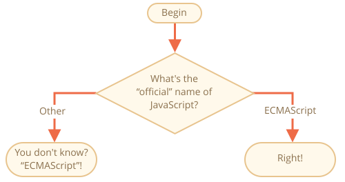

importance: 2

---

# JavaScript'in ismi

`if..else` bloğu kullanarak "JavaScript\'in resmi ismi nedir?" sorusunu sorun. 

<<<<<<< HEAD
Eğer kullanıcı "ECMAScript" cevabı verirse "Doğru" diğer türlü "ECMAScript olduğunu bilmiyormusun?" yazısını alarm olarak gösterin.
=======
If the visitor enters "ECMAScript", then output "Right!", otherwise -- output: "You don't know? ECMAScript!"
>>>>>>> 5e893cffce8e2346d4e50926d5148c70af172533

[demo src="ifelse_task2"]
