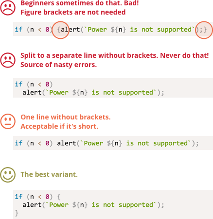

# Kodlama Stili

Kodunuz olabildiğince okunaklı ve temiz olmalıdır.

<<<<<<< HEAD
Aslında bu programlama sanatıdır -- karmaşık bir görevi alın ve bunu olabildiğince doğru ve okunaklı bir şekle getirin.
=======
That is actually the art of programming -- to take a complex task and code it in a way that is both correct and human-readable. A good code style greatly assists in that.  
>>>>>>> 51bc6d3cdc16b6eb79cb88820a58c4f037f3bf19

Buna yardımcı olan bir şey de iyi kodlama stilidir.

<<<<<<< HEAD

## Yazım

Kodlar için yazılmış bir kopya kağıdı (detayları aşağıda):

=======
Here is a cheat sheet with some suggested rules (see below for more details):

>>>>>>> 51bc6d3cdc16b6eb79cb88820a58c4f037f3bf19

<!--
```js
function pow(x, n) {
  let result = 1;

  for (let i = 0; i < n; i++) {
    result *= x;
  }

  return result;
}

let x = prompt("x?", "");
let n = prompt("n?", "");

if (n < 0) {
  alert(`Power ${n} is not supported,
    please enter a non-negative integer number`);
} else {
  alert( pow(x, n) );
}
```

-->
Şimdi bu kurallar ve nedenleri hakkında konuşabiliriz.

Buradaki hiçbir şey kanun değildir. Hepsi sizin zevkinize kalmıştır ve değişebilir. Buradaki kodlama kuralları dogmalara dayanmaz.

<<<<<<< HEAD
### Süslü Parantez
=======
```warn header="There are no \"you must\" rules"
Nothing is set in stone here. These are style preferences, not religious dogmas.
```
>>>>>>> 51bc6d3cdc16b6eb79cb88820a58c4f037f3bf19

Çoğu JavaScript projesinde süslü parantezler yeni satırda değil de kod ile aynı satırda yazılırlar. Buna "mısırlı" stili denir. Ayrıca süslü parantezin başında aşağıdaki gibi boşluk bırakılır.


```js
if (kosul) {
  // şunu yap
  // ...bunu yap
  // ...sonra bunu yap
}
```
Tek satırlı `if` cümlelerinde süslü parantez kullanmalı mı ? Kullanılacaksa nasıl yazılmalı?

<<<<<<< HEAD
Burada not düşülerek `if` örnekleri verilmiş. Siz de bu kodların okunabilirliğini yargılayabilirsiniz.
=======
A single-line construct, such as `if (condition) doSomething()`, is an important edge case. Should we use braces at all?

Here are the annotated variants so you can judge their readability for yourself:
>>>>>>> 51bc6d3cdc16b6eb79cb88820a58c4f037f3bf19

1. 😠 Beginners sometimes do that. Bad! Curly braces are not needed:
    ```js
    if (n < 0) *!*{*/!*alert(`Power ${n} is not supported`);*!*}*/!*
    ```
2. 😠 Split to a separate line without braces. Never do that, easy to make an error when adding new lines:
    ```js
    if (n < 0)
      alert(`Power ${n} is not supported`);
    ```
3. 😏 One line without braces - acceptable, if it's short:
    ```js
    if (n < 0) alert(`Power ${n} is not supported`);
    ```
4. 😃 The best variant:
    ```js
    if (n < 0) {
      alert(`Power ${n} is not supported`);
    }
    ```

<<<<<<< HEAD
if (n < 0) alert(`Power ${n} is not supported`);

if (n < 0)
  alert(`Power ${n} is not supported`);

if (n < 0) {
  alert(`Power ${n} is not supported`);
}
```
-->

1. Süslü parantez açma ve kapama aynı satırda yapılmış: Burada süslü paranteze gerek yok.
2. Ayrı bir satıra süslü parantez olmadan yazılmış. Bu şekilde yazmayın. Bu ileride bazı anlayamadığınız hatalara neden olabilir. Örneğin `if` gövdesine bir satır daha yazarsanız bu satırlardan sonraki yazdığınız çalışmaz.
3. Süslü parantez olmadan tek satırda işi bitirebilirseniz kabul edilebilir. Ama kısa olması şartıyla.
4. Bunların içerisindeki en iyisi.

Özetle:
- Çok kısa kodlar için, şu şekilde kullanım kabul edilebilir: `if(koşul) return null`.
- Eğer ayrı satırlara yazmanız gerekiyorsa kesin süslü parantez kullanın.
=======
For a very brief code, one line is allowed, e.g. `if (cond) return null`. But a code block (the last variant) is usually more readable.
>>>>>>> 51bc6d3cdc16b6eb79cb88820a58c4f037f3bf19

### Satır uzunluğu

<<<<<<< HEAD
En uzun satır boyunun bir sınırı olmalı. Kimse yatayda kodu takip etmek istemez. Eğer o kadar uzun ise yeni bir satıra geçmeniz önerilir.
=======
No one likes to read a long horizontal line of code. It's best practice to split them.

For example:
```js
// backtick quotes ` allow to split the string into multiple lines
let str = `
  ECMA International's TC39 is a group of JavaScript developers,
  implementers, academics, and more, collaborating with the community
  to maintain and evolve the definition of JavaScript.
`;
```

And, for `if` statements:

```js
if (
  id === 123 &&
  moonPhase === 'Waning Gibbous' &&
  zodiacSign === 'Libra'
) {
  letTheSorceryBegin();
}
```
>>>>>>> 51bc6d3cdc16b6eb79cb88820a58c4f037f3bf19

Satır uzunluğu limitine takım seviyesinde karar verilir. Genelde 80-120 karakter arasındadır.

### Satır başı boşlukları

İki türlü satır başı standardı vardır.

- **Yatay boşluklar:2(4) boşluk.**

<<<<<<< HEAD
    Yatay boşluklar genelde 2 veya 4 veya "Tab" sembolünden oluşur. Bunlardan hangisinin seçilmesi gerektiği bir çeşit savaştır. Bugünlerde boşluk tuşu ile boşluk bırakmak daha fazla kullanılan yöntemdir.

    Boşluk tuşu ile satıra başlamanın "Tab" a göre üstünlüğü daha esnek ayarlanabilir olmasından dolayıdır.

    Örneğin argümanlar şu şekilde hizalanabilir:
=======
    A horizontal indentation is made using either 2 or 4 spaces or the horizontal tab symbol (key `key:Tab`). Which one to choose is an old holy war. Spaces are more common nowadays.

    One advantage of spaces over tabs is that spaces allow more flexible configurations of indents than the tab symbol.

    For instance, we can align the parameters with the opening bracket, like this:
>>>>>>> 51bc6d3cdc16b6eb79cb88820a58c4f037f3bf19

    ```js no-beautify
    goster(parametreler,
         hizalandı, // soldan 5 boşluk
         ilki,
         sonra,
         digeri
      ) {
      // ...
    }
    ```

- **Dikey boşluk: mantıksal blokları ayırmak için satır arası bırakmak**

    En basit bir fonksiyonda bile mantıksal blokları ayırma ihtiyacınız olabilir. Aşağıdaki örnekte, değişkenlerin tanımlanması ve sonucun dikey olarak ayrılmasına dikkat edin:

    ```js
    function üst(x, n) {
      let sonuc = 1;
      //              <--
      for (let i = 0; i < n; i++) {
        sonuc *= x;
      }
      //              <--
      return sonuc;
    }
    ```

    Eğer okunurluluğa etki edecekse yeni bir satır arası vermekten çekinmeyin. Kanıya göre 9 satırdan fazla kod varsa arada kesin bir satır arası olmalıdır.

### Noktalı virgül

Her cümlenin sonuna noktalı virgül konulmalıdır. Tercihli olsa bile tercih her zaman noktalı virgül tarafında olmalıdır.

<<<<<<< HEAD
Bazı dillerde noktalı virgül tamamen tercihe bağlıdır. O dilde nadiren kullanılır. Fakat JavaScript için bazı durumlarda yeni satır noktalı virgül olarak algılanmayabilir. Bu da programlama hatasına neden olur.

Eğer sonuçlarını ve nasıl kullanılacağına inancınız tamsa bu durumda noktalı virgül kullanmayabilirsiniz. Fakat başlangıçta kesinlikle kullanmalısınız.
=======
There are languages where a semicolon is truly optional and it is rarely used. In JavaScript, though, there are cases where a line break is not interpreted as a semicolon, leaving the code vulnerable to errors. See more about that in the chapter <info:structure#semicolon>.

If you're an experienced JavaScript programmer, you may choose a no-semicolon code style like [StandardJS](https://standardjs.com/). Otherwise, it's best to use semicolons to avoid possible pitfalls. The majority of developers put semicolons.
>>>>>>> 51bc6d3cdc16b6eb79cb88820a58c4f037f3bf19

### İç içelik seviyesi

Çok fazla iç içe kod yazmamalısınız.

<<<<<<< HEAD
Bazı durumlarda döngü içinde ["continue"](info:while-for#continue) kullanmak iyi bir fikir olabilir.
=======
For example, in the loop, it's sometimes a good idea to use the [`continue`](info:while-for#continue) directive to avoid extra nesting.
>>>>>>> 51bc6d3cdc16b6eb79cb88820a58c4f037f3bf19

Aşağıdaki kullanım yerine:

```js
for (let i = 0; i < 10; i++) {
  if (kosul) {
    ... // <- bir tane daha koşul ( iç içe )
  }
}
```

Bu şekilde yazılabilir:

```js
for (let i = 0; i < 10; i++) {
  if (!cond) *!*continue*/!*;
  ...  // <- ayrıca bir tane daha iç içe kod yok.
}
```

Aynı şekilde bunun benzeri `if/else` ve `return` için yapılabilir.

Örneğin aşağıdaki iki yapı birbiri ile aynı.


Birincisi:

```js
function ust(x, n) {
  if (n < 0) {
    alert("Negatif sayılar desteklenmemektedir");
  } else {
    let sonuc = 1;

    for (let i = 0; i < n; i++) {
      sonuc *= x;
    }

    return sonuc;
  }
}
```

ve ikincisi:

```js
function ust(x, n) {
  if (n < 0) {
    alert("Negatif sayılar desteklenmemektedir");
    return;
  }

  let sonuc = 1;

  for (let i = 0; i < n; i++) {
    sonuc *= x;
  }

  return sonuc;
}
```

<<<<<<< HEAD
... fakat ikincisi daha okunaklıdır, çünkü `n<0` koşulu ilk önce kontrol edildi ve buna göre aksiyon alındı sonrasında ana kod akışına devam edildi, ayrıca bir `else` yazmaya gerek kalmadı.
=======
The second one is more readable because the "special case" of `n < 0` is handled early on. Once the check is done we can move on to the "main" code flow without the need for additional nesting.
>>>>>>> 51bc6d3cdc16b6eb79cb88820a58c4f037f3bf19

## Kodun altında fonksiyonlar

Eğer birkaç tane "helper"(yardımcı) fonksiyon yazıyorsanız bunları yerleştirmenin üç farklı yolu var.

<<<<<<< HEAD
1. Kullanan kodun üstünde fonksiyonları tanımlamak:
=======
1. Declare the functions *above* the code that uses them:
>>>>>>> 51bc6d3cdc16b6eb79cb88820a58c4f037f3bf19

    ```js
    // *!*function declarations*/!*
    function elementOlustur() {
      ...
    }

    function isleyiciTanimla(elem) {
      ...
    }

    function etrafindanDolan() {
      ...
    }

    // *!*fonksiyonları kullanan kodlar*/!*
    let elem = elementOlustur();
    isleyiciTanimla(elem);
    etrafindaDolan();
    ```
2. Önce kodu yazıp sonra fonksiyonu yazmak:

    ```js
    // *!*fonksiyonları kullanan kodlar*/!*
    let elem = elementOlustur();
    isleyiciTanimla(elem);
    etrafindaDolan();

    // --- *!*yardımcı fonksiyonlar*/!* ---

    function elementOlustur() {
      ...
    }

    function isleyiciTanimla(elem) {
      ...
    }

    function etrafindanDolan() {
      ...
    }
    ```

3. Karışık: Fonksiyonu kullanıldığı yerde tanımlama.

<<<<<<< HEAD
Çoğu zaman ikinci yöntem tercih edilmektedir. Çünkü kodu okumaya başladığınızda, öncelik bu kodun "ne yaptığı" olur. Eğer önce kod yazılırsa bu bazı bilgiler verir. Sonrasında belki de fonksiyonları okumamıza hiç gerek kalmayabilir. Özellikle isimlendirme iyi ise buna gerek yoktur.
=======
That's because when reading code, we first want to know *what it does*. If the code goes first, then it becomes clear from the start. Then, maybe we won't need to read the functions at all, especially if their names are descriptive of what they actually do.
>>>>>>> 51bc6d3cdc16b6eb79cb88820a58c4f037f3bf19

## Stil Kılavuzu

<<<<<<< HEAD
Stil kılavuzları genel olarak "nasıl yazılmalı" sorusunun cevabını verir: Kaç satır bırakılmalıdır, nerede yeni satıra geçilmelidir vs. çok küçük küçük şeyler.
=======
A style guide contains general rules about "how to write" code, e.g. which quotes to use, how many spaces to indent, the maximal line length, etc. A lot of minor things.
>>>>>>> 51bc6d3cdc16b6eb79cb88820a58c4f037f3bf19

Genel olarak tüm takım üyeleri bu kurallara uyduğunda kod tek bir elden çıkmış gibi görünür. Kimin yazdığı önemini yitirir.

<<<<<<< HEAD
Tabi takımın kendine ait bir stil kılavuzu da olabilir. Fakat çoğu daha önce denendiğinden dolayı yenisini oluşturmaya gerek yoktur. Örneğin:
=======
Of course, a team can always write their own style guide, but usually there's no need to. There are many existing guides to choose from.
>>>>>>> 51bc6d3cdc16b6eb79cb88820a58c4f037f3bf19


- [Google JavaScript Style Guide](https://google.github.io/styleguide/jsguide.html)
- [Airbnb JavaScript Style Guide](https://github.com/airbnb/javascript)
- [Idiomatic.JS](https://github.com/rwaldron/idiomatic.js)
- [StandardJS](https://standardjs.com/)
- (ve birçoğu)

<<<<<<< HEAD
Eğer kodlamaya yeni başladıysanız, şimdilik yukarıda bahsettiğimiz kopya kağıdından faydalanabilirsiniz. Daha sonra stil kılavuzlarına bakarak istediğinizi örnek alabilir ve bir tanesini seçebilirsiniz.
=======
If you're a novice developer, start with the cheat sheet at the beginning of this chapter. Then you can browse other style guides to pick up more ideas and decide which one you like best.
>>>>>>> 51bc6d3cdc16b6eb79cb88820a58c4f037f3bf19

## Otomatik Düzenleyiciler

<<<<<<< HEAD
Kod stilinizi otomatik olarak denetleyen araçlar bulunmaktadır. Bunlara "düzenleyici" - linter denebilir.

Bunların en önemli özelliği stili kontrol etmesinin yanında yazımdaki hataları, fonksiyon isimlerindeki problemleri bulur.

Bundan dolayı bir tanesini kullanmanız önerilir. Sadece kelime hatalarını düzeltmeniz için bile olsa kullanmanız iyidir.

En çok bilinen araçlar:

- [JSLint](http://www.jslint.com/) -- ilk düzenleyicilerden
- [JSHint](http://www.jshint.com/) -- JSLint'ten daha fazla özelliğe sahip.
- [ESLint](http://eslint.org/) -- en yenilerinden.
=======
Linters are tools that can automatically check the style of your code and make improving suggestions.

The great thing about them is that style-checking can also find some bugs, like typos in variable or function names. Because of this feature, using a linter is recommended even if you don't want to stick to one particular "code style".

Here are some well-known linting tools:

- [JSLint](https://www.jslint.com/) -- one of the first linters.
- [JSHint](https://jshint.com/) -- more settings than JSLint.
- [ESLint](https://eslint.org/) -- probably the newest one.

All of them can do the job. The author uses [ESLint](https://eslint.org/).
>>>>>>> 51bc6d3cdc16b6eb79cb88820a58c4f037f3bf19

Hepsi de işinizi görür. Yazar  [ESLint](http://eslint.org/) kullanmaktadır.

Çoğu otomatik düzenleyici editör ile entegre çalışır. Sadece plugin'i aktif edin, kod stilini ayarlayın yeterli.

Örneğin ESLint için şu adımları yapmalısınız:

1. [Node.JS](https://nodejs.org/)'i bilgisayarınıza yükleyin.
2. Komut satırından `npm install -g eslint` ile ESLint'i yükleyin. ( npm NodeJs paket yöneticisidir)
3. JavaScript projenizin bulunduğu klasöre `.eslintrc` adında bir dosya oluşturun

Örnek bir `.eslintrc` dosyası:

```js
{
  "extends": "eslint:recommended",
  "env": {
    "browser": true,
    "node": true,
    "es6": true
  },
  "rules": {
    "no-console": 0,
<<<<<<< HEAD
  },
  "indent": 2
=======
    "indent": 2
  }
>>>>>>> 51bc6d3cdc16b6eb79cb88820a58c4f037f3bf19
}
```
Buradaki `"extends"` normalde `eslint:recommended` i kullanacağımız fakat bunun bazı özelliklerini değiştireceğimizi belirtmektedir.

Bunun ardından editörünüzde ESLint eklentisini aktif edin. Çoğu editörde bu eklenti bulunmaktadır.

<<<<<<< HEAD
Bunun yanında bu stilleri internetten indirip kullanmakta mümkündür. Bunun için
<http://eslint.org/docs/user-guide/getting-started> adresine bakabilirsiniz.
=======
It is also possible to download style rule sets from the web and extend them instead. See <https://eslint.org/docs/user-guide/getting-started> for more details about installation.
>>>>>>> 51bc6d3cdc16b6eb79cb88820a58c4f037f3bf19

Bunun yanında otomatik düzenleyici kullanmanın yan etkileri de vardır. Kod düzenleyiciler eğer tanımlanmamış bir değişken kullanılmışsa, bunu anlar ve vurgular. Fakat çoğu defa bunun nedeni yanlış yazımdır. Tabi bunu fark ederseniz düzeltmesi de hemen yapılabilir.

Bundan dolayı eğer stil ile ilgilenmiyorsanız bile kullanmanız şiddetle tavsiye edilir.

<<<<<<< HEAD
Ayrıca bazı IDEler bu otomatik düzenleyicileri kendileri doğrudan entegre ederler. Bunlarda iyidir fakat düzenlemesi biraz daha karmaşık olabilir. Bundan dolayı ESLint gibi araçlar kullanmanız önerilir.

=======
All syntax rules described in this chapter (and in the style guides referenced) aim to increase the readability of your code. All of them are debatable.

When we think about writing "better" code, the questions we should ask ourselves are: "What makes the code more readable and easier to understand?" and "What can help us avoid errors?" These are the main things to keep in mind when choosing and debating code styles.
>>>>>>> 51bc6d3cdc16b6eb79cb88820a58c4f037f3bf19

## Özet

Bu bölümdeki tüm yazım kurallar ve stil kılavuzlarının amacı okunabilirliği artırmaktır. Bundan dolayı tamamı tartışılabilir.

"Nasıl daha iyi yazarız?" sorusu hakkında düşündüğümüzde, kriter "Nasıl daha iyi okunur kod yazabilir, nasıl yazarken hatalardan kaçabiliriz?" sorularını aklımızda tutmamız gereklidir. Buna göre stil seçip hangisinin daha iyi olduğuna karar verebiliriz.

Stil kılavuzlarını okuyun ve son gelişmeler hakkında daha iyi bilgi sahibi olun, buna göre en iyiyi seçebilirsiniz.
