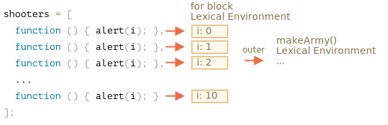

`orduYap` fonksiyonunun içine bakılacak olursa sonuç daha açık bir şekilde görülecektir.


1. Boş `nisancilar` dizisi yaratır.

    ```js
    let nisancilar = [];
    ```

2. `nisancilar.push(function..)` döngüsü ile doldurur.

    Her bir elemanı fonksiyondur, buna göre sonuç dizisi aşağıdaki gibi olacaktır:
    
    ```js no-beautify
    nisancilar = [
      function () { alert(i); },
      function () { alert(i); },
      function () { alert(i); },
      function () { alert(i); },
      function () { alert(i); },
      function () { alert(i); },
      function () { alert(i); },
      function () { alert(i); },
      function () { alert(i); },
      function () { alert(i); }
    ];
    ```

3. En nihayetinde dizi fonksiyondan döner.

Sonrasında `ordu[5]()` çalıştığında diziden `ordu[5]` elemanı alınır ( fonksiyon olacaktır ) ve çağırılır.

Peki neden tüm fonksiyonlar aynı şeyi gösterir?

Bunun nedeni `nisancilar` fonksiyonunun içinde `i` değişkeninin olmamasıdır. Böyle bir i fonksiyonu çağırıldığında `i` değeri dış ortamdan alınır.

`i`'nin değeri nedir ?

Yine kaynak koda bakılacak olursa:

```js
function orduYap() {
  ...
  let i = 0;
  while (i < 10) {
    let nisanci = function() { // nisanci fonksiyonu
      alert( i ); // numarayı yazmalı
    };
    ...
  }
  ...
}
```

...Sizin de görebilecğeiniz gibi `orduYap()` ile aynı sözcüksel ortamda bulunmaktadır. Fakat `ordu[5]()` çağırıldığında, `orduYap()` işini bitirmiş ve son değeri olan `10`'u almış oluyor.( `while`'ın sonu `10` olmaktadır.

Sonuç olarak tüm `nisanci` fonksiyonları dış sözcüksel ortamdan `i=10` değerini alırlar.

Bu basit bir şekilde düzeltilebilir:

```js run
function orduYap() {

  let nisancilar = [];

*!*
  for(let i = 0; i < 10; i++) {
*/!*
    let nisanci = function() { // nisanci fonksiyonu
      alert( i ); // numarayı yazmalı
    };
    nisancilar.push(shooter);
  }

  return nisancilar;
}

let ordu = orduYap();

ordu[0](); // 0
ordu[5](); // 5
```

Şimdi doğru çalışmaktadır çünkü `for(...){...}` bloğu her çalıştığında yeni bir Sözcüksel Ortam yaratılır ve o ortama ait `i` değeri tanımlanır.

Artık `i` değeri daha yakındır. `orduYap()` Sözcüksel Ortamından ayrılmışır, döngünün her adımında kendine has bir Sözcüksel Çevreye sahiptir. Her bir `nisanci`'da yaratıldığı ortamdaki değerlere bakar.



`while` döngüsünü `for`'a çevirerek bu problemi çözmüş olduk.

Bunu sağlayan başka bir yöntem daha vardır:


```js run
function orduYap() {
  let nisancilar = [];

  let i = 0;
  while (i < 10) {
*!*
    let j = i;
*/!*
    let nisanci = function() { // nisanci fonksiyonu
      alert( *!*j*/!* ); //  numarayı yazmalı
    };
    nisancilar.push(shooter);
    i++;
  }

  return nisancilar;
}

let ordu = orduYap();

ordu[0](); // 0
ordu[5](); // 5
```
`while` döngüsü değişkedi fakat `for` döngüsünde olduğu gibi değerler her döngüde oluşan Sözcüksel Ortama atanacak şekilde ayarlandı. Böylece her `nisanci` çağırıldığında doğru değeri alması garantilendi.

`let j = i` ile `i` nin yerel bir kopyasını oluşturmuş olduk. İlkel değişkenler "değer ile" kopyalandığından dolayı artık `i` den tamamen farklı bir değişkene sahip olduk.