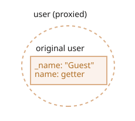

<<<<<<< HEAD

# Proxy ve Reflect

Bir *proxy* (vekil), başka bir nesneyi sarmalar ve özellik okuma/yazma gibi işlemleri engeller (intercept eder). Bu işlemleri kendisi yönetebilir veya şeffaf bir şekilde hedef nesnenin yönetmesine izin verebilir.

Proxy’ler birçok kütüphanede ve bazı tarayıcı framework’lerinde kullanılır. Bu bölümde birçok pratik kullanım örneği göreceğiz.
=======
# Proxy and Reflect

A `Proxy` object wraps another object and intercepts operations, like reading/writing properties and others, optionally handling them on its own, or transparently allowing the object to handle them.

Proxies are used in many libraries and some browser frameworks. We'll see many practical applications in this article.

## Proxy
>>>>>>> d78b01e9833009fab534462e05c03cffc51bf0e3

Sözdizimi:

```js
let proxy = new Proxy(target, handler)
```

<<<<<<< HEAD
- `target` -- sarmalanacak nesne; fonksiyonlar da dahil olmak üzere herhangi bir şey olabilir.
- `handler` -- işlemleri yakalayan (“trap” adı verilen) metotları içeren bir nesnedir. Örneğin, bir özelliği okumak için `get`, bir özelliğe yazmak için `set` gibi.
=======
- `target` -- is an object to wrap, can be anything, including functions.
- `handler` -- proxy configuration: an object with "traps", methods that intercept operations. - e.g. `get` trap for reading a property of `target`, `set` trap for writing a property into `target`, and so on.
>>>>>>> d78b01e9833009fab534462e05c03cffc51bf0e3

`proxy` üzerinde bir işlem yapılırsa, `handler` içinde o işleme karşılık gelen bir trap varsa, o çalıştırılır; yoksa işlem `target`üzerinde gerçekleştirilir.

Basit bir örnek olarak, hiç trap içermeyen bir proxy oluşturalım:

```js run
let target = {};
let proxy = new Proxy(target, {}); // boş handler

proxy.test = 5; // proxy’ye yazma (1)
alert(target.test); // 5, özellik target üzerinde belirdi!

alert(proxy.test); // 5, proxy’den de okuyabiliyoruz (2)

for(let key in proxy) alert(key); // test, döngü çalışıyor (3)
```

Hiç trap olmadığından, `proxy` üzerindeki tüm işlemler `target`’a yönlendirilir.

1. `proxy.test=` yazma işlemi, değeri `target` üzerine yazar.
2. `proxy.test` okuma işlemi, değeri `target`’tan döndürür.
3. `proxy` üzerinde döngü yapmak, `target`’taki değerleri döndürür.

Gördüğümüz gibi, trap olmadan `proxy`, `target` üzerinde şeffaf bir sarmalayıcı gibi davranır.

<<<<<<< HEAD
  

Proxy, özel bir “egzotik nesnedir”. Kendi özellikleri yoktur. Boş bir handler ile, işlemleri tamamen `target`’a yönlendirir.

Eğer sihirli bir davranış istiyorsak, trap’ler eklememiz gerekir.

[Proxy spesifikasyonu](https://tc39.es/ecma262/#sec-proxy-object-internal-methods-and-internal-slots)’nda tanımlanmış bir dizi dahili nesne işlemi vardır. Bir proxy, bunlardan herhangi birini yakalayabilir; bunun için handler’a karşılık gelen metodu eklememiz yeterlidir.

Aşağıdaki tabloda:
- **İçsel Metot(Internal Method)** Spesifikasyondaki dahili işlemin adıdır. Örneğin, `[[Get]]` bir özelliği okuma işlemidir.
- **Handler Metodu(Handler Method)** `handler`’a eklememiz gereken metot adıdır; bu metot işlemi yakalar ve özel bir davranış tanımlar.
=======


`Proxy` is a special "exotic object". It doesn't have own properties. With an empty `handler` it transparently forwards operations to `target`.

To activate more capabilities, let's add traps.

What can we intercept with them?

For most operations on objects, there's a so-called "internal method" in the JavaScript specification that describes how it works at the lowest level. For instance `[[Get]]`, the internal method to read a property, `[[Set]]`, the internal method to write a property, and so on. These methods are only used in the specification, we can't call them directly by name.
>>>>>>> d78b01e9833009fab534462e05c03cffc51bf0e3

Proxy traps intercept invocations of these methods. They are listed in the [Proxy specification](https://tc39.es/ecma262/#sec-proxy-object-internal-methods-and-internal-slots) and in the table below.

<<<<<<< HEAD
| İçsel Metot | Handler Metodu | Yakalanan İşlem(Traps)... |
|-----------------|----------------|-------------|
| `[[Get]]` | `get` | özelliği okuma |
| `[[Set]]` | `set` | özelliğe yazma |
| `[[HasProperty]]` | `has` | `in` operatörü |
| `[[Delete]]` | `deleteProperty` | `delete` operatörü |
| `[[Call]]` | `apply` | fonksiyon çağrısı |
| `[[Construct]]` | `construct` | `new` operatörü |
| `[[GetPrototypeOf]]` | `getPrototypeOf` | [Object.getPrototypeOf](https://developer.mozilla.org/en-US/docs/Web/JavaScript/Reference/Global_Objects/Object/getPrototypeOf) |
| `[[SetPrototypeOf]]` | `setPrototypeOf` | [Object.setPrototypeOf](https://developer.mozilla.org/en-US/docs/Web/JavaScript/Reference/Global_Objects/Object/setPrototypeOf) |
| `[[IsExtensible]]` | `isExtensible` | [Object.isExtensible](https://developer.mozilla.org/en-US/docs/Web/JavaScript/Reference/Global_Objects/Object/isExtensible) |
| `[[PreventExtensions]]` | `preventExtensions` | [Object.preventExtensions](https://developer.mozilla.org/en-US/docs/Web/JavaScript/Reference/Global_Objects/Object/preventExtensions) |
| `[[GetOwnProperty]]` | `getOwnPropertyDescriptor` | [Object.getOwnPropertyDescriptor](https://developer.mozilla.org/en-US/docs/Web/JavaScript/Reference/Global_Objects/Object/getOwnPropertyDescriptor) |
| `[[DefineOwnProperty]]` | `defineProperty` | [Object.defineProperty](https://developer.mozilla.org/en-US/docs/Web/JavaScript/Reference/Global_Objects/Object/defineProperty), [Object.defineProperties](https://developer.mozilla.org/en-US/docs/Web/JavaScript/Reference/Global_Objects/Object/defineProperties) |
| `[[OwnPropertyKeys]]` | `ownKeys` | [Object.keys](https://developer.mozilla.org/en-US/docs/Web/JavaScript/Reference/Global_Objects/Object/keys), [Object.getOwnPropertyNames](https://developer.mozilla.org/en-US/docs/Web/JavaScript/Reference/Global_Objects/Object/getOwnPropertyNames), [Object.getOwnPropertySymbols](https://developer.mozilla.org/en-US/docs/Web/JavaScript/Reference/Global_Objects/Object/getOwnPropertySymbols), yineleme anahtarları |
=======
For every internal method, there's a trap in this table: the name of the method that we can add to the `handler` parameter of `new Proxy` to intercept the operation:

| Internal Method | Handler Method | Triggers when... |
|-----------------|----------------|-------------|
| `[[Get]]` | `get` | reading a property |
| `[[Set]]` | `set` | writing to a property |
| `[[HasProperty]]` | `has` | `in` operator |
| `[[Delete]]` | `deleteProperty` | `delete` operator |
| `[[Call]]` | `apply` | function call |
| `[[Construct]]` | `construct` | `new` operator |
| `[[GetPrototypeOf]]` | `getPrototypeOf` | [Object.getPrototypeOf](mdn:/JavaScript/Reference/Global_Objects/Object/getPrototypeOf) |
| `[[SetPrototypeOf]]` | `setPrototypeOf` | [Object.setPrototypeOf](mdn:/JavaScript/Reference/Global_Objects/Object/setPrototypeOf) |
| `[[IsExtensible]]` | `isExtensible` | [Object.isExtensible](mdn:/JavaScript/Reference/Global_Objects/Object/isExtensible) |
| `[[PreventExtensions]]` | `preventExtensions` | [Object.preventExtensions](mdn:/JavaScript/Reference/Global_Objects/Object/preventExtensions) |
| `[[DefineOwnProperty]]` | `defineProperty` | [Object.defineProperty](mdn:/JavaScript/Reference/Global_Objects/Object/defineProperty), [Object.defineProperties](mdn:/JavaScript/Reference/Global_Objects/Object/defineProperties) |
| `[[GetOwnProperty]]` | `getOwnPropertyDescriptor` | [Object.getOwnPropertyDescriptor](mdn:/JavaScript/Reference/Global_Objects/Object/getOwnPropertyDescriptor), `for..in`, `Object.keys/values/entries` |
| `[[OwnPropertyKeys]]` | `ownKeys` | [Object.getOwnPropertyNames](mdn:/JavaScript/Reference/Global_Objects/Object/getOwnPropertyNames), [Object.getOwnPropertySymbols](mdn:/JavaScript/Reference/Global_Objects/Object/getOwnPropertySymbols), `for..in`, `Object.keys/values/entries` |
>>>>>>> d78b01e9833009fab534462e05c03cffc51bf0e3

```warn header="Değişmez kurallar (Invariants)"
JavaScript, bazı değişmez kuralları zorunlu kılar. Bu kurallar, içsel metotlar ve trap’lerin belirli koşulları yerine getirmesini sağlar.

Çoğu, dönüş değerleriyle ilgilidir:
- `[[Set]]` başarılıysa `true`, değilse `false` döndürmelidir.
- `[[Delete]]` başarılıysa `true`, değilse `false` döndürmelidir.
- …ve benzerleri; aşağıda örneklerde göreceğiz.

<<<<<<< HEAD
Bazı diğer kurallar:
- `[[GetPrototypeOf]]` çağrıldığında, proxy nesnesinin prototipi, hedef nesneninkiyle aynı olmalıdır.

Yani, bir `proxy`’nin prototipini okuduğumuzda, her zaman hedef nesnenin prototipini döndürmelidir. `getPrototypeOf` trap bu işlemi yakalayabilir ama bu kurala uymalıdır.

Bu değişmez kurallar, dilin tutarlı ve doğru çalışmasını sağlar. Tüm liste [spesifikasyonda](https://tc39.es/ecma262/#sec-proxy-object-internal-methods-and-internal-slots) bulunur; genellikle sıradışı bir şey yapmadığınız sürece ihlal etmezsiniz.

```

Haydi bunun pratik örneklerde nasıl çalıştığına bakalım.
=======
There are some other invariants, like:
- `[[GetPrototypeOf]]`, applied to the proxy object must return the same value as `[[GetPrototypeOf]]` applied to the proxy object's target object. In other words, reading prototype of a proxy must always return the prototype of the target object.

Traps can intercept these operations, but they must follow these rules.

Invariants ensure correct and consistent behavior of language features. The full invariants list is in [the specification](https://tc39.es/ecma262/#sec-proxy-object-internal-methods-and-internal-slots). You probably won't violate them if you're not doing something weird.
```

Let's see how that works in practical examples.
>>>>>>> d78b01e9833009fab534462e05c03cffc51bf0e3

## "get" tuzağı ile varsayılan değer

En yaygın trap’ler özellik okuma/yazma içindir.

<<<<<<< HEAD
Okumayı yakalamak için, `handler` içinde `get(target, property, receiver)` adlı bir metot bulunmalıdır.

Bir özellik okunduğunda tetiklenir:

- `target` -- hedef nesnedir; `new Proxy`’ye ilk argüman olarak verilen nesne,
- `property` -- özellik adı,
- `receiver` -- eğer özellik bir getter ise, o kodda `this` olarak kullanılacak nesnedir. Genellikle bu `proxy` nesnesinin kendisidir (veya proxy’den miras alıyorsak ondan türeyen nesne).
=======
To intercept reading, the `handler` should have a method `get(target, property, receiver)`.

It triggers when a property is read, with following arguments:

- `target` -- is the target object, the one passed as the first argument to `new Proxy`,
- `property` -- property name,
- `receiver` -- if the target property is a getter, then `receiver` is the object that's going to be used as `this` in its call. Usually that's the `proxy` object itself (or an object that inherits from it, if we inherit from proxy). Right now we don't need this argument, so it will be explained in more detail later.
>>>>>>> d78b01e9833009fab534462e05c03cffc51bf0e3

Bir nesne için varsayılan değerleri uygulamak üzere `get`’i kullanalım.

<<<<<<< HEAD
Örneğin, sayısal bir dizinin var olmayan indeksler için `undefined` yerine `0` döndürmesini istiyoruz.

Bunu, okumayı yakalayan ve öyle bir özellik yoksa varsayılan değer döndüren bir proxy ile saralım:

=======
We'll make a numeric array that returns `0` for nonexistent values.

Usually when one tries to get a non-existing array item, they get `undefined`, but we'll wrap a regular array into the proxy that traps reading and returns `0` if there's no such property:
>>>>>>> d78b01e9833009fab534462e05c03cffc51bf0e3

```js run
let numbers = [0, 1, 2];

numbers = new Proxy(numbers, {
  get(target, prop) {
    if (prop in target) {
      return target[prop];
    } else {
      return 0; // varsayılan değer
    }
  }
});

*!*
alert( numbers[1] ); // 1
<<<<<<< HEAD
alert( numbers[123] ); // 0 (böyle bir değer yok)
*/!*
```

Bu yaklaşım geneldir. "Varsayılan" değer mantığını `Proxy` ile istediğimiz gibi kurabiliriz.

Diyelim ki elimizde ifadeler ve onların çevirilerinden oluşan bir sözlük var:
=======
alert( numbers[123] ); // 0 (no such item)
*/!*
```

As we can see, it's quite easy to do with a `get` trap.

We can use `Proxy` to implement any logic for "default" values.

Imagine we have a dictionary, with phrases and their translations:
>>>>>>> d78b01e9833009fab534462e05c03cffc51bf0e3

```js run
let dictionary = {
  'Hello': 'Hola',
  'Bye': 'Adiós'
};

alert( dictionary['Hello'] ); // Hola
alert( dictionary['Welcome'] ); // undefined
```

<<<<<<< HEAD
Şu anda, bir ifade yoksa `dictionary`’den okumak `undefined` döndürüyor. Ama pratikte, çevrilmemiş bir ifadeyi olduğu gibi bırakmak çoğu zaman `undefined`’dan daha iyidir. O hâlde, `undefined` yerine varsayılan değerin çevrilmemiş ifadenin kendisi olmasını sağlayalım.
=======
Right now, if there's no phrase, reading from `dictionary` returns `undefined`. But in practice, leaving a phrase untranslated is usually better than `undefined`. So let's make it return an untranslated phrase in that case instead of `undefined`.
>>>>>>> d78b01e9833009fab534462e05c03cffc51bf0e3

Bunu başarmak için, okumayı yakalayan bir proxy ile`dictionary`’yi saracağız:

```js run
let dictionary = {
  'Hello': 'Hola',
  'Bye': 'Adiós'
};

dictionary = new Proxy(dictionary, {
*!*
  get(target, phrase) { // dictionary’den bir özellik okunmasını yakala
*/!*
    if (phrase in target) { // sözlükte varsa
      return target[phrase]; // çeviriyi döndür
    } else {
      // yoksa, çevrilmemiş ifadeyi döndür
      return phrase;
    }
  }
});

<<<<<<< HEAD
// Sözlükte rastgele ifadeleri ara!
// En kötü ihtimalle çevrilmemiş olarak dönerler.
=======
// Look up arbitrary phrases in the dictionary!
// At worst, they're not translated.
>>>>>>> d78b01e9833009fab534462e05c03cffc51bf0e3
alert( dictionary['Hello'] ); // Hola
*!*
alert( dictionary['Welcome to Proxy']); // Welcome to Proxy (çeviri yok)
*/!*
```

<<<<<<< HEAD
````smart header="Proxy, her yerde `target` yerine kullanılmalıdır"
Proxy’nin değişkenin üzerine nasıl yazdığına dikkat edin:
=======
````smart
Please note how the proxy overwrites the variable:
>>>>>>> d78b01e9833009fab534462e05c03cffc51bf0e3

```js
dictionary = new Proxy(dictionary, ...);
```

Proxy, hedef nesnenin yerini her yerde tamamen almalıdır. Bir nesne proxylenmişse, sonrasında kimse hedef nesneye doğrudan referans vermemelidir. Aksi takdirde işler kolayca karışır.
````

## "set" tuzağı ile doğrulama (Validation)

<<<<<<< HEAD
Şimdi yazma işlemlerini de yakalayalım.

Diyelim ki yalnızca sayılardan oluşan bir dizi istiyoruz. Eğer farklı türde bir değer eklenirse, bir hata fırlatılmalı.

`set` tuzağı (trap), bir özellik yazıldığında tetiklenir: `set(target, property, value, receiver)`

- `target` -- hedef nesnedir; `new Proxy`’ye ilk argüman olarak verilen nesne,
- `property` -- özellik adı,
- `value` -- özellik değeri,
- `receiver` -- `get` tuzağındakiyle aynıdır; yalnızca özellik bir setter ise önemlidir.

`set` tuzağı, işlem başarılıysa `true`, başarısızsa `false` döndürmelidir (aksi hâlde `TypeError` oluşur).
=======
Let's say we want an array exclusively for numbers. If a value of another type is added, there should be an error.

The `set` trap triggers when a property is written.

`set(target, property, value, receiver)`:

- `target` -- is the target object, the one passed as the first argument to `new Proxy`,
- `property` -- property name,
- `value` -- property value,
- `receiver` -- similar to `get` trap, matters only for setter properties.

The `set` trap should return `true` if setting is successful, and `false` otherwise (triggers `TypeError`).
>>>>>>> d78b01e9833009fab534462e05c03cffc51bf0e3

Yeni değerleri doğrulamak için bunu kullanalım:

```js run
let numbers = [];

numbers = new Proxy(numbers, { // (*)
*!*
  set(target, prop, val) { // özelliğe yazmayı yakala
*/!*
    if (typeof val == 'number') {
      target[prop] = val;
      return true;
    } else {
      return false;
    }
  }
});

numbers.push(1); // added successfully
numbers.push(2); // added successfully
alert("Length is: " + numbers.length); // 2

*!*
numbers.push("test"); // TypeError ('set' on proxy returned false)
*/!*

alert("Bu satıra asla ulaşılmaz (yukarıdaki satırda hata var)");
```

<<<<<<< HEAD
Dikkat ederseniz, dizinin yerleşik işlevleri hâlâ çalışıyor!
Yeni değerler eklendiğinde `length` özelliği otomatik olarak artıyor. Proxy’miz hiçbir şeyi bozmadı.

Ayrıca`push`, `unshift` gibi değer ekleyen metotları da yeniden tanımlamamız gerekmedi.
Çünkü bunlar dahili olarak `[[Set]]` işlemini kullanırlar ve bu işlem proxy tarafından yakalanır.
=======
Please note: the built-in functionality of arrays is still working! Values are added by `push`. The `length` property auto-increases when values are added. Our proxy doesn't break anything.

We don't have to override value-adding array methods like `push` and `unshift`, and so on, to add checks in there, because internally they use the `[[Set]]` operation that's intercepted by the proxy.
>>>>>>> d78b01e9833009fab534462e05c03cffc51bf0e3

Kod bu sayede hem temiz hem de kısa olur.

```warn header="`true` döndürmeyi unutmayın"
Yukarıda belirtildiği gibi, bazı değişmez kurallar (invariant) vardır.

`set` işlemi başarılıysa `true` döndürmelidir.

<<<<<<< HEAD
Eğer yanlış (falsy) bir değer döndürülürse (veya hiç değer döndürülmezse), bu `TypeError` hatasına neden olur.
```

## "deleteProperty" ve "ownKeys" ile korunan özellikler

Yaygın bir konvansiyona göre, `_` (alt çizgi) ile başlayan özellikler ve metotlar içseldir.  
Bu tür özelliklere nesnenin dışından erişilmemelidir.

Teknik olarak erişmek mümkündür:
=======
If we forget to do it or return any falsy value, the operation triggers `TypeError`.
```

## Iteration with "ownKeys" and "getOwnPropertyDescriptor"

`Object.keys`, `for..in` loop and most other methods that iterate over object properties use `[[OwnPropertyKeys]]` internal method (intercepted by `ownKeys` trap) to get a list of properties.

Such methods differ in details:
- `Object.getOwnPropertyNames(obj)` returns non-symbol keys.
- `Object.getOwnPropertySymbols(obj)` returns symbol keys.
- `Object.keys/values()` returns non-symbol keys/values with `enumerable` flag (property flags were explained in the article <info:property-descriptors>).
- `for..in` loops over non-symbol keys with `enumerable` flag, and also prototype keys.

...But all of them start with that list.

In the example below we use `ownKeys` trap to make `for..in` loop over `user`, and also `Object.keys` and `Object.values`, to skip properties starting with an underscore `_`:

```js run
let user = {
  name: "John",
  age: 30,
  _password: "***"
};

user = new Proxy(user, {
*!*
  ownKeys(target) {
*/!*
    return Object.keys(target).filter(key => !key.startsWith('_'));
  }
});

// "ownKeys" filters out _password
for(let key in user) alert(key); // name, then: age

// same effect on these methods:
alert( Object.keys(user) ); // name,age
alert( Object.values(user) ); // John,30
```

So far, it works.

Although, if we return a key that doesn't exist in the object, `Object.keys` won't list it:

```js run
let user = { };

user = new Proxy(user, {
*!*
  ownKeys(target) {
*/!*
    return ['a', 'b', 'c'];
  }
});

alert( Object.keys(user) ); // <empty>
```

Why? The reason is simple: `Object.keys` returns only properties with the `enumerable` flag. To check for it, it calls the internal method `[[GetOwnProperty]]` for every property to get [its descriptor](info:property-descriptors). And here, as there's no property, its descriptor is empty, no `enumerable` flag, so it's skipped.

For `Object.keys` to return a property, we need it to either exist in the object, with the `enumerable` flag, or we can intercept calls to `[[GetOwnProperty]]` (the trap `getOwnPropertyDescriptor` does it), and return a descriptor with `enumerable: true`.

Here's an example of that:

```js run
let user = { };

user = new Proxy(user, {
  ownKeys(target) { // called once to get a list of properties
    return ['a', 'b', 'c'];
  },

  getOwnPropertyDescriptor(target, prop) { // called for every property
    return {
      enumerable: true,
      configurable: true
      /* ...other flags, probable "value:..." */
    };
  }

});

alert( Object.keys(user) ); // a, b, c
```

Let's note once again: we only need to intercept `[[GetOwnProperty]]` if the property is absent in the object.

## Protected properties with "deleteProperty" and other traps

There's a widespread convention that properties and methods prefixed by an underscore `_` are internal. They shouldn't be accessed from outside the object.

Technically that's possible though:
>>>>>>> d78b01e9833009fab534462e05c03cffc51bf0e3

```js run
let user = {
  name: "John",
  _password: "secret"
};

alert(user._password); // secret
```

Şimdi `_` ile başlayan özelliklere erişimi engellemek için proxy kullanalım.

<<<<<<< HEAD
Bunun için şu tuzaklara ihtiyacımız var:
- `get` okuma sırasında hata fırlatmak için,
- `set` yazma sırasında hata fırlatmak için,
- `deleteProperty` silme sırasında hata fırlatmak için,
- `ownKeys` `_` ile başlayan özellikleri `for...in` döngüsü veya `Object.keys()` gibi işlemlerden gizlemek için.
=======
We'll need the traps:
- `get` to throw an error when reading such property,
- `set` to throw an error when writing,
- `deleteProperty` to throw an error when deleting,
- `ownKeys` to exclude properties starting with `_` from `for..in` and methods like `Object.keys`.
>>>>>>> d78b01e9833009fab534462e05c03cffc51bf0e3

Kod şu şekilde olur:

```js run
let user = {
  name: "John",
  _password: "***"
};

user = new Proxy(user, {
*!*
  get(target, prop) {
*/!*
    if (prop.startsWith('_')) {
      throw new Error("Erişim reddedildi");
    }
    let value = target[prop];
    return (typeof value === 'function') ? value.bind(target) : value; // (*)
  },
*!*
  set(target, prop, val) { // yazma işlemini yakala
*/!*
    if (prop.startsWith('_')) {
      throw new Error("Erişim reddedildi");
    } else {
      target[prop] = val;
      return true;
    }
  },
*!*
<<<<<<< HEAD
  deleteProperty(target, prop) { // silme işlemini yakala
*/!*  
=======
  deleteProperty(target, prop) { // to intercept property deletion
*/!*
>>>>>>> d78b01e9833009fab534462e05c03cffc51bf0e3
    if (prop.startsWith('_')) {
      throw new Error("Erişim reddedildi");
    } else {
      delete target[prop];
      return true;
    }
  },
*!*
  ownKeys(target) { // özellik listesini yakala
*/!*
    return Object.keys(target).filter(key => !key.startsWith('_'));
  }
});

// "get" -> _password okunamaz
try {
  alert(user._password); // Hata: Erişim reddedildi
} catch(e) { alert(e.message); }

// "set" -> _password yazılamaz
try {
  user._password = "test"; // Hata: Erişim reddedildi
} catch(e) { alert(e.message); }

// "deleteProperty" -> _password silinemez
try {
  delete user._password; // Hata: Erişim reddedildi
} catch(e) { alert(e.message); }

// "ownKeys" -> _password filtrelenir
for(let key in user) alert(key); // name
```

<<<<<<< HEAD
Lütfen `get` tuzağındaki, `(*)` satırındaki önemli detaya dikkat edin:
=======
Please note the important detail in the `get` trap, in the line `(*)`:
>>>>>>> d78b01e9833009fab534462e05c03cffc51bf0e3

```js
get(target, prop) {
  // ...
  let value = target[prop];
*!*
  return (typeof value === 'function') ? value.bind(target) : value; // (*)
*/!*
}
```

<<<<<<< HEAD
Bir nesne metodu çağrıldığında, örneğin `user.checkPassword()`, bu metodun `_password`’a erişebilmesi gerekir:
=======
Why do we need a function to call `value.bind(target)`?

The reason is that object methods, such as `user.checkPassword()`, must be able to access `_password`:
>>>>>>> d78b01e9833009fab534462e05c03cffc51bf0e3

```js
user = {
  // ...
  checkPassword(value) {
    // nesne metodu _password'ı okuyabilmeli
    return value === this._password;
  }
}
```

<<<<<<< HEAD
Normalde, `user.checkPassword()` çağrısında `this` olarak proxylanmış `user` geçer (noktadan önceki nesne `this` olur). Bu yüzden metod `this._password`’a erişmeye çalıştığında, özellik koruması devreye girer ve hata fırlatır. İşte bu nedenle `(*)` satırında metodu `target`’a bağlarız (`bind`). Böylece o fonksiyon içindeki tüm işlemler doğrudan orijinal nesneye yapılır ve özellik korumasına takılmaz.

Bu çözüm ideal değildir; çünkü metot, proxylanmamış nesneyi başka bir yere aktarabilir ve sonrasında işler karışabilir: Orijinal nesne nerede, proxy nerede?

Bir nesne birden fazla kez proxylanabilir (farklı proxy’ler nesneye farklı “ince ayarlar” ekleyebilir), bu da garip hatalara yol açabilir.

Dolayısıyla, metotları olan karmaşık nesneler için bu tür bir proxy kullanımı önerilmez.

```smart header="Bir sınıfın özel (private) özellikleri"
Modern JavaScript motorları, `#` ile başlayan sınıf içi özel özellikleri yerel olarak destekler. Bunlar <info:private-protected-properties-methods> bölümünde anlatılmıştır. Proxy gerekmez.
=======

A call to `user.checkPassword()` gets proxied `user` as `this` (the object before dot becomes `this`), so when it tries to access `this._password`, the `get` trap activates (it triggers on any property read) and throws an error.

So we bind the context of object methods to the original object, `target`, in the line `(*)`. Then their future calls will use `target` as `this`, without any traps.

That solution usually works, but isn't ideal, as a method may pass the unproxied object somewhere else, and then we'll get messed up: where's the original object, and where's the proxied one?

Besides, an object may be proxied multiple times (multiple proxies may add different "tweaks" to the object), and if we pass an unwrapped object to a method, there may be unexpected consequences.

So, such a proxy shouldn't be used everywhere.

```smart header="Private properties of a class"
Modern JavaScript engines natively support private properties in classes, prefixed with `#`. They are described in the article <info:private-protected-properties-methods>. No proxies required.
>>>>>>> d78b01e9833009fab534462e05c03cffc51bf0e3

Ancak bu özelliklerin de kendine özgü sorunları vardır. Özellikle, kalıtılmazlar.
```

<<<<<<< HEAD

## "has" tuzağı ile "in range" (aralıkta mı?) denetimi

Bir aralık (range) nesnemiz olduğunu varsayalım:
=======
## "In range" with "has" trap

Let's see more examples.

We have a range object:
>>>>>>> d78b01e9833009fab534462e05c03cffc51bf0e3

```js
let range = {
  start: 1,
  end: 10
};
```

<<<<<<< HEAD
Bir sayının `range` içinde olup olmadığını denetlemek için "in" operatörünü kullanmak istiyoruz.

"has" tuzağı, "in" çağrılarını yakalar: `has(target, property)`
=======
We'd like to use the `in` operator to check that a number is in `range`.

The `has` trap intercepts `in` calls.

`has(target, property)`
>>>>>>> d78b01e9833009fab534462e05c03cffc51bf0e3

- `target` -- `new Proxy`’ye ilk argüman olarak geçirilen hedef nesne,,
- `property` -- özellik adı

Örnek:

```js run
let range = {
  start: 1,
  end: 10
};

range = new Proxy(range, {
*!*
  has(target, prop) {
*/!*
    return prop >= target.start && prop <= target.end;
  }
});

*!*
alert(5 in range); // true
alert(50 in range); // false
*/!*
```

<<<<<<< HEAD
Güzel bir sözdizim şekeri, değil mi?

## Fonksiyonları sarmalamak: "apply"
=======
Nice syntactic sugar, isn't it? And very simple to implement.

## Wrapping functions: "apply" [#proxy-apply]
>>>>>>> d78b01e9833009fab534462e05c03cffc51bf0e3

Bir fonksiyonun etrafına da proxy sarabiliriz.

`apply(target, thisArg, args)` tuzağı, proxy’nin fonksiyon gibi çağrılmasını yakalar:

<<<<<<< HEAD
- `target` hedef nesne (fonksiyon),
- `thisArg` çağrıda kullanılacak `this` değeri,
- `args` argümanların listesi.

Örneğin, <info:call-apply-decorators> bölümünde yaptığımız `delay(f, ms)` dekoratörünü hatırlayalım.

Orada proxy kullanmadan yapmıştık. `delay(f, ms)` çağrısı, tüm çağrıları `ms` milisaniye sonra `f`’e ileten bir fonksiyon döndürüyordu.

Fonksiyon-tabanlı uygulama:

```js run
// proxy yok, sadece bir sarmalayıcı fonksiyon
=======
- `target` is the target object (function is an object in JavaScript),
- `thisArg` is the value of `this`.
- `args` is a list of arguments.

For example, let's recall `delay(f, ms)` decorator, that we did in the article <info:call-apply-decorators>.

In that article we did it without proxies. A call to `delay(f, ms)` returned a function that forwards all calls to `f` after `ms` milliseconds.

Here's the previous, function-based implementation:

```js run
>>>>>>> d78b01e9833009fab534462e05c03cffc51bf0e3
function delay(f, ms) {
  // timeout sonrası çağrıyı f'ye ileten bir sarmalayıcı döndür
  return function() { // (*)
    setTimeout(() => f.apply(this, arguments), ms);
  };
}

function sayHi(user) {
  alert(`Hello, ${user}!`);
}

<<<<<<< HEAD
// artık sayHi çağrıları 3 saniye gecikmeli
=======
// after this wrapping, calls to sayHi will be delayed for 3 seconds
>>>>>>> d78b01e9833009fab534462e05c03cffc51bf0e3
sayHi = delay(sayHi, 3000);

sayHi("John"); // Hello, John! (3 saniye sonra)
```

<<<<<<< HEAD
Gördüğünüz gibi, çoğunlukla çalışıyor. `(*)` satırındaki sarmalayıcı fonksiyon, çağrıyı bekleme süresinden sonra gerçekleştiriyor.

Ama sarmalayıcı fonksiyon, özellik okuma/yazma gibi diğer işlemleri iletmez. Dolayısıyla, orijinal fonksiyonun bir özelliği varsa, sarmalamadan sonra ona erişemeyiz:
=======
As we've seen already, that mostly works. The wrapper function `(*)` performs the call after the timeout.

But a wrapper function does not forward property read/write operations or anything else. After the wrapping, the access is lost to properties of the original functions, such as `name`, `length` and others:
>>>>>>> d78b01e9833009fab534462e05c03cffc51bf0e3

```js run
function delay(f, ms) {
  return function() {
    setTimeout(() => f.apply(this, arguments), ms);
  };
}

function sayHi(user) {
  alert(`Hello, ${user}!`);
}

*!*
<<<<<<< HEAD
alert(sayHi.length); // 1 (function length argüman sayısıdır)
=======
alert(sayHi.length); // 1 (function length is the arguments count in its declaration)
>>>>>>> d78b01e9833009fab534462e05c03cffc51bf0e3
*/!*

sayHi = delay(sayHi, 3000);

*!*
<<<<<<< HEAD
alert(sayHi.length); // 0 (sarmalayıcının argümanı yok)
*/!*
```


`Proxy` çok daha güçlüdür; çünkü her şeyi hedef nesneye iletir.
=======
alert(sayHi.length); // 0 (in the wrapper declaration, there are zero arguments)
*/!*
```

`Proxy` is much more powerful, as it forwards everything to the target object.
>>>>>>> d78b01e9833009fab534462e05c03cffc51bf0e3

Sarmalayıcı fonksiyon yerine `Proxy` kullanalım:

```js run
function delay(f, ms) {
  return new Proxy(f, {
    apply(target, thisArg, args) {
      setTimeout(() => target.apply(thisArg, args), ms);
    }
  });
}

function sayHi(user) {
  alert(`Hello, ${user}!`);
}

sayHi = delay(sayHi, 3000);

*!*
alert(sayHi.length); // 1 (*) proxy "length" okuma işlemini hedefe iletir
*/!*

sayHi("John"); // Hello, John! (3 saniye sonra)
```

Sonuç aynı, ancak artık yalnızca çağrılar değil, proxy üzerindeki tüm işlemler de orijinal fonksiyona iletiliyor. Bu nedenle `(*)` satırında sarmalamadan sonra `sayHi.length` doğru şekilde döndü.

Böylece daha “zengin” bir sarmalayıcı elde etmiş olduk.

<<<<<<< HEAD
Başka trap’ler de var, fakat sanırım artık mantığı anladınız.

## Reflect

`Reflect` API’si, `Proxy` ile birlikte çalışmak üzere tasarlanmıştır.

Yakalanabilecek (trap’lenebilecek) her dahili nesne işlemi için bir `Reflect` metodu vardır.  
Bu metodun adı ve parametreleri, ilgili trap ile aynıdır ve işlemi hedef nesneye iletmek için kullanılabilir.
=======
Other traps exist: the full list is in the beginning of this article. Their usage pattern is similar to the above.

## Reflect

`Reflect` is a built-in object that simplifies creation of `Proxy`.

It was said previously that internal methods, such as `[[Get]]`, `[[Set]]` and others are specification-only, they can't be called directly.

The `Reflect` object makes that somewhat possible. Its methods are minimal wrappers around the internal methods.

Here are examples of operations and `Reflect` calls that do the same:

| Operation |  `Reflect` call | Internal method |
|-----------------|----------------|-------------|
| `obj[prop]` | `Reflect.get(obj, prop)` | `[[Get]]` |
| `obj[prop] = value` | `Reflect.set(obj, prop, value)` | `[[Set]]` |
| `delete obj[prop]` | `Reflect.deleteProperty(obj, prop)` | `[[Delete]]` |
| `new F(value)` | `Reflect.construct(F, value)` | `[[Construct]]` |
| ... | ... | ... |
>>>>>>> d78b01e9833009fab534462e05c03cffc51bf0e3


Örneğin:

```js run
let user = {};

Reflect.set(user, 'name', 'John');

alert(user.name); // John
```

In particular, `Reflect` allows us to call operators (`new`, `delete`...) as functions (`Reflect.construct`, `Reflect.deleteProperty`, ...). That's an interesting capability, but here another thing is important.

**For every internal method, trappable by `Proxy`, there's a corresponding method in `Reflect`, with the same name and arguments as the `Proxy` trap.**

So we can use `Reflect` to forward an operation to the original object.

In this example, both traps `get` and `set` transparently (as if they didn't exist) forward reading/writing operations to the object, showing a message:

```js run
let user = {
  name: "John",
};

user = new Proxy(user, {
  get(target, prop, receiver) {
    alert(`GET ${prop}`);
*!*
    return Reflect.get(target, prop, receiver); // (1)
*/!*
  },
  set(target, prop, val, receiver) {
    alert(`SET ${prop}=${val}`);
*!*
    return Reflect.set(target, prop, val, receiver); // (2)
*/!*
  }
});

let name = user.name; // shows "GET name"
user.name = "Pete"; // shows "SET name=Pete"
```

<<<<<<< HEAD
- `Reflect.get`, tıpkı `target[prop]` gibi özelliği okur.
- `Reflect.set`, tıpkı `target[prop] = value` gibi özelliği yazar, ayrıca doğru dönüş değerini de garanti eder.

Çoğu durumda `Reflect` kullanmadan da aynı işi yapabiliriz, ancak bazı ince detayları kaçırabiliriz.

Aşağıdaki örneğe bakalım; `Reflect` kullanılmamış ve yanlış sonuç veriyor:

Bir user nesnesini proxy’liyoruz, sonra ondan kalıtım alıp bir getter kullanıyoruz:
=======
Here:

- `Reflect.get` reads an object property.
- `Reflect.set` writes an object property and returns `true` if successful, `false` otherwise.

That is, everything's simple: if a trap wants to forward the call to the object, it's enough to call `Reflect.<method>` with the same arguments.

In most cases we can do the same without `Reflect`, for instance, reading a property `Reflect.get(target, prop, receiver)` can be replaced by `target[prop]`. There are important nuances though.

### Proxying a getter

Let's see an example that demonstrates why `Reflect.get` is better. And we'll also see why `get/set` have the third argument `receiver`, that we didn't use before.

We have an object `user` with `_name` property and a getter for it.

Here's a proxy around it:
>>>>>>> d78b01e9833009fab534462e05c03cffc51bf0e3

```js run
let user = {
  _name: "Guest",
  get name() {
    return this._name;
  }
};

*!*
<<<<<<< HEAD
// Beklenen: Admin
alert(admin.name); // Guest (?!?)
=======
let userProxy = new Proxy(user, {
  get(target, prop, receiver) {
    return target[prop];
  }
});
>>>>>>> d78b01e9833009fab534462e05c03cffc51bf0e3
*/!*

alert(userProxy.name); // Guest
```

<<<<<<< HEAD
Gördüğünüz gibi sonuç hatalı! `admin.name` değerinin `"Admin"` olması gerekirken `"Guest"` döndü. Proxy olmadan `"Admin"` olacaktı; proxyleme nesneyi “bozmuş” gibi görünüyor.



Peki neden? Son satırdaki çağrının ne yaptığına bakalım:

1. `admin` içinde `name` özelliği yok, bu yüzden çağrı `admin`’in prototipine gider.
2. Prototip bir proxy olduğu için, `get` tuzağı `name` okuma girişimini yakalar.
3. `(*)` satırında `target[prop]` döndürülür, peki `target` nedir?
    - `target`, `get`’in ilk parametresidir ve her zaman `new Proxy`’ye verilen orijinal nesnedir(`user`).
    - Dolayısıyla, `target[prop]` getter `name`’i `this=target=user` olarak çağırır.
    - Bu yüzden sonuç `"Guest"` olur.

Bunu nasıl düzeltiriz? İşte bu noktada üçüncü parametre olan `receiver` devreye girer! `receiver`, doğru `this` değerini tutar. Sadece `Reflect.get`’i çağırarak bu değeri aktarabiliriz.

Doğru çözüm şöyle olur:
=======
The `get` trap is "transparent" here, it returns the original property, and doesn't do anything else. That's enough for our example.

Everything seems to be all right. But let's make the example a little bit more complex.

After inheriting another object `admin` from `user`, we can observe the incorrect behavior:
>>>>>>> d78b01e9833009fab534462e05c03cffc51bf0e3

```js run
let user = {
  _name: "Guest",
  get name() {
    return this._name;
  }
};

let userProxy = new Proxy(user, {
  get(target, prop, receiver) {
    return target[prop]; // (*) target = user
  }
});

*!*
let admin = {
  __proto__: userProxy,
  _name: "Admin"
};

// Expected: Admin
alert(admin.name); // outputs: Guest (?!?)
*/!*
```

Reading `admin.name` should return `"Admin"`, not `"Guest"`!

What's the matter? Maybe we did something wrong with the inheritance?

But if we remove the proxy, then everything will work as expected.

The problem is actually in the proxy, in the line `(*)`.

1. When we read `admin.name`, as `admin` object doesn't have such own property, the search goes to its prototype.
2. The prototype is `userProxy`.
3. When reading `name` property from the proxy, its `get` trap triggers and returns it from the original object as `target[prop]` in the line `(*)`.

    A call to `target[prop]`, when `prop` is a getter, runs its code in the context `this=target`. So the result is `this._name` from the original object `target`, that is: from `user`.

To fix such situations, we need `receiver`, the third argument of `get` trap. It keeps the correct `this` to be passed to a getter. In our case that's `admin`.

How to pass the context for a getter? For a regular function we could use `call/apply`, but that's a getter, it's not "called", just accessed.

`Reflect.get` can do that. Everything will work right if we use it.

Here's the corrected variant:

```js run
let user = {
  _name: "Guest",
  get name() {
    return this._name;
  }
};

let userProxy = new Proxy(user, {
  get(target, prop, receiver) { // receiver = admin
*!*
    return Reflect.get(target, prop, receiver); // (*)
*/!*
  }
});


let admin = {
  __proto__: userProxy,
  _name: "Admin"
};

*!*
alert(admin.name); // Admin
*/!*
```

<<<<<<< HEAD
Artık `receiver`, doğru `this` değerini tutarak getter’a `Reflect.get` aracılığıyla (`(*)` satırında) aktarılır ve her şey düzgün çalışır.

Ayrıca tuzağı şu şekilde de yazabilirdik:
=======
Now `receiver` that keeps a reference to the correct `this` (that is `admin`), is passed to the getter using `Reflect.get` in the line `(*)`.

We can rewrite the trap even shorter:
>>>>>>> d78b01e9833009fab534462e05c03cffc51bf0e3

```js
get(target, prop, receiver) {
  return Reflect.get(*!*...arguments*/!*);
}
```

<<<<<<< HEAD
`Reflect` çağrıları, tuzaklarla birebir aynı isimlere ve argümanlara sahiptir.
Bu özellikle böyle tasarlanmıştır.
=======

`Reflect` calls are named exactly the same way as traps and accept the same arguments. They were specifically designed this way.
>>>>>>> d78b01e9833009fab534462e05c03cffc51bf0e3

Dolayısıyla `return Reflect...` şeklinde bir çağrı, işlemi güvenli bir şekilde iletmenin ve hiçbir detayı unutmamanın en kolay yoludur.

## Proxy Sınırlamaları

<<<<<<< HEAD
Proxy’ler, var olan nesnelerin (hatta yerleşik olanların, örn. diziler) davranışlarını değiştirmek veya özelleştirmek için mükemmel bir araçtır.

Yine de, bazı sınırlamaları vardır.
=======
Proxies provide a unique way to alter or tweak the behavior of the existing objects at the lowest level. Still, it's not perfect. There are limitations.
>>>>>>> d78b01e9833009fab534462e05c03cffc51bf0e3

### Yerleşik Nesneler: İçsel Slotlar (Internal Slots)

Birçok yerleşik nesne, örneğin `Map`, `Set`, `Date`, `Promise` ve benzerleri, “içsel slot” (internal slot) denen yapıları kullanır.

<<<<<<< HEAD
Bunlar özelliklere benzer, ancak dahili amaçlar için ayrılmıştır.
Yerleşik metotlar bu slotlara doğrudan erişir, `[[Get]]/[[Set]]` gibi içsel metotları kullanmazlar. Bu yüzden `Proxy` bunları yakalayamaz.

“Eee ne olmuş, sonuçta dahili yapılar!” diyebilirsiniz.

Ama sorun şudur:
Böyle bir yerleşik nesne proxylenirse, proxy bu içsel slotlara sahip olmaz ve dolayısıyla yerleşik metotlar çalışmaz.
=======
These are like properties, but reserved for internal, specification-only purposes. For instance, `Map` stores items in the internal slot `[[MapData]]`. Built-in methods access them directly, not via `[[Get]]/[[Set]]` internal methods. So `Proxy` can't intercept that.

Why care? They're internal anyway!

Well, here's the issue. After a built-in object like that gets proxied, the proxy doesn't have these internal slots, so built-in methods will fail.
>>>>>>> d78b01e9833009fab534462e05c03cffc51bf0e3

Örneğin:

```js run
let map = new Map();

let proxy = new Proxy(map, {});

*!*
proxy.set('test', 1); // Hata
*/!*
```

<<<<<<< HEAD
Bir `Map` üzerinde `set` çağırmak başarısız olur; çünkü bu davranış [içsel implementasyona](https://tc39.es/ecma262/#sec-map.prototype.set) bağlıdır.

Dahili olarak bir `Map`, tüm verilerini `[[MapData]]` adlı içsel slotta saklar. Proxy’de böyle bir slot yoktur. `set` metodu `this.[[MapData]]`’ya erişmeye çalışır; ancak `this=proxy` olduğu için bulamaz ve hata verir.
=======
Internally, a `Map` stores all data in its `[[MapData]]` internal slot. The proxy doesn't have such a slot. The [built-in method `Map.prototype.set`](https://tc39.es/ecma262/#sec-map.prototype.set) method tries to access the internal property `this.[[MapData]]`, but because `this=proxy`, can't find it in `proxy` and just fails.
>>>>>>> d78b01e9833009fab534462e05c03cffc51bf0e3

Neyse ki bunu düzeltmenin bir yolu var:

```js run
let map = new Map();

let proxy = new Proxy(map, {
  get(target, prop, receiver) {
    let value = Reflect.get(...arguments);
*!*
    return typeof value == 'function' ? value.bind(target) : value;
*/!*
  }
});

proxy.set('test', 1);
alert(proxy.get('test')); // 1 (çalışıyor!)
```

Şimdi düzgün çalışıyor, çünkü `get` tuzağı fonksiyon özellikleri (`map.set` gibi), hedef nesneye (`map`) bağlıyor.

Böylece `proxy.set(...)` içindeki `this` artık `proxy` değil, orijinal `map` olur. Dolayısıyla `set` metodu `this.[[MapData]]` slotuna erişmeye çalıştığında başarılı olur.

```smart header="`Array`'in içsel slotları yoktur"
Belirgin bir istisna: yerleşik `Array` içsel slotlar kullanmaz. Bu tarihsel bir sebepten dolayıdır, çok eski bir yapı olduğundan.

Bu nedenle, dizileri proxy’lemek bu tür bir soruna yol açmaz.
```

### Özel Alanlar (Private Fields)

<<<<<<< HEAD
Benzer bir durum, sınıflardaki özel (private) alanlarda da görülür.
=======
A similar thing happens with private class fields.
>>>>>>> d78b01e9833009fab534462e05c03cffc51bf0e3

Örneğin, `getName()` metodu özel `#name` alanına erişir, ancak proxy uygulandıktan sonra bozulur:

```js run
class User {
  #name = "Guest";

  getName() {
    return this.#name;
  }
}

let user = new User();

user = new Proxy(user, {});

*!*
alert(user.getName()); // Error
*/!*
```

Bunun nedeni, özel alanların (private fields) dahili slotlar (internal slots) kullanılarak uygulanmasıdır.
JavaScript, bunlara erişirken `[[Get]]` veya `[[Set]]` mekanizmalarını kullanmaz.

<<<<<<< HEAD
`user.getName()` çağrısında, `this` değeri proxylanmış kullanıcı nesnesidir ve bu nesnede özel alanların bulunduğu slot yoktur.
=======
In the call `getName()` the value of `this` is the proxied `user`, and it doesn't have the slot with private fields.
>>>>>>> d78b01e9833009fab534462e05c03cffc51bf0e3

Daha önceki örneklerde olduğu gibi, metodu hedef nesneye bağlayarak (`bind`) bu durumu düzeltebiliriz:

```js run
class User {
  #name = "Guest";

  getName() {
    return this.#name;
  }
}

let user = new User();

user = new Proxy(user, {
  get(target, prop, receiver) {
    let value = Reflect.get(...arguments);
    return typeof value == 'function' ? value.bind(target) : value;
  }
});

alert(user.getName()); // Guest
```

<<<<<<< HEAD
Ancak bu çözümün daha önce açıkladığımız bir dezavantajı var:
Metot, orijinal nesneye doğrudan erişim kazanır ve onu başka bir yere aktarabilir.
Bu da diğer proxy işlevselliklerini bozabilir.

### Proxy != target

Proxy ve orijinal nesne farklı nesnelerdir. Bu oldukça doğaldır, değil mi?

Yani bir nesneyi bir yerde saklayıp daha sonra proxy’larsak, bazı şeyler bozulabilir:
=======
That said, the solution has drawbacks, as explained previously: it exposes the original object to the method, potentially allowing it to be passed further and breaking other proxied functionality.

### Proxy != target

The proxy and the original object are different objects. That's natural, right?

So if we use the original object as a key, and then proxy it, then the proxy can't be found:
>>>>>>> d78b01e9833009fab534462e05c03cffc51bf0e3

```js run
let allUsers = new Set();

class User {
  constructor(name) {
    this.name = name;
    allUsers.add(this);
  }
}

let user = new User("John");

alert(allUsers.has(user)); // true

user = new Proxy(user, {});

*!*
alert(allUsers.has(user)); // false
*/!*
```

Gördüğünüz gibi, proxylamadan sonra `user`, `allUsers` kümesinde bulunamıyor çünkü proxy farklı bir nesne.

```warn header="Proxy'ler sıkı eşitlik testini `===` yakalayamaz"
Proxy’ler `new` (-> `construct`), `in` (-> `has`), `delete` (-> `deleteProperty`) gibi birçok işlemi yakalayabilir.

Ancak, nesneler için sıkı eşitlik testi (`===`) yakalanamaz.
Bir nesne yalnızca kendisine eşittir; başka hiçbir şeye değil.

Bu nedenle, nesneleri karşılaştıran tüm işlemler ve yerleşik sınıflar, nesne ile proxy arasında ayrım yapar.
Yani proxy’ler tam anlamıyla “şeffaf” bir yedek olamaz.
```

<<<<<<< HEAD

## Geri Alınabilir Proxy’ler (Revocable Proxies)
=======
## Revocable proxies
>>>>>>> d78b01e9833009fab534462e05c03cffc51bf0e3

*Revocable proxy*, yani “geri alınabilir proxy”, devre dışı bırakılabilen bir proxy türüdür.

Diyelim ki bir kaynağımız var ve istediğimiz anda bu kaynağa erişimi kapatmak istiyoruz.

<<<<<<< HEAD
Bunu, herhangi bir trap eklemeden bir “revocable proxy” ile sarmalayabiliriz.  
Bu proxy işlemleri hedef nesneye iletir, ancak ayrıca onu devre dışı bırakmak için özel bir fonksiyon sağlar.
=======
What we can do is to wrap it into a revocable proxy, without any traps. Such a proxy will forward operations to object, and we can disable it at any moment.
>>>>>>> d78b01e9833009fab534462e05c03cffc51bf0e3


Sözdizimi şöyledir:

```js
let {proxy, revoke} = Proxy.revocable(target, handler)
```

Bu çağrı, iki özellik döndürür:
- `proxy` vekil nesne,
- `revoke` bu proxy’yi devre dışı bırakmak için kullanılan fonksiyon.

Örnek:

```js run
let object = {
  data: "Valuable data"
};

let {proxy, revoke} = Proxy.revocable(object, {});

// nesne yerine proxy’yi bir yere aktarabiliriz...
alert(proxy.data); // Valuable data

// kodun ilerleyen bir kısmında
revoke();

// proxy artık çalışmaz (devre dışı)
alert(proxy.data); // Hata
```

<<<<<<< HEAD
`revoke()` çağrısı, proxy’nin hedef nesneyle olan tüm dahili bağlantılarını kaldırır.
Böylece artık birbirleriyle ilişkili değildirler.
Bu noktadan sonra hedef nesne, çöp toplayıcı (garbage collector) tarafından silinebilir.

Ayrıca `revoke` fonksiyonunu bir `WeakMap` içinde saklayarak, proxy üzerinden kolayca bulabiliriz:
=======
A call to `revoke()` removes all internal references to the target object from the proxy, so they are no longer connected. 

Initially, `revoke` is separate from `proxy`, so that we can pass `proxy` around while leaving `revoke` in the current scope.
>>>>>>> d78b01e9833009fab534462e05c03cffc51bf0e3

We can also bind `revoke` method to proxy by setting `proxy.revoke = revoke`.

Another option is to create a `WeakMap` that has `proxy` as the key and the corresponding `revoke` as the value, that allows to easily find `revoke` for a proxy:

```js run
*!*
let revokes = new WeakMap();
*/!*

let object = {
  data: "Valuable data"
};

let {proxy, revoke} = Proxy.revocable(object, {});

revokes.set(proxy, revoke);

<<<<<<< HEAD
// ...kodun ilerleyen kısmında...
=======
// ..somewhere else in our code..
>>>>>>> d78b01e9833009fab534462e05c03cffc51bf0e3
revoke = revokes.get(proxy);
revoke();

alert(proxy.data); // Hata (revoked)
```

<<<<<<< HEAD
Bu yaklaşımın avantajı, `revoke` fonksiyonunu her yere taşımak zorunda olmamamızdır.
Proxy üzerinden `WeakMap` aracılığıyla gerektiğinde erişebiliriz.

Burada `Map` yerine `WeakMap` kullanmamızın nedeni, çöp toplamayı engellememesidir.
Eğer bir proxy nesnesine artık erişilmiyorsa (örneğin hiçbir değişken onu tutmuyorsa), `WeakMap` onun bellekten silinmesine izin verir. Çünkü artık `revoke` fonksiyonuna da ihtiyacımız yoktur.
=======
We use `WeakMap` instead of `Map` here because it won't block garbage collection. If a proxy object becomes "unreachable" (e.g. no variable references it any more), `WeakMap` allows it to be wiped from memory together with its `revoke` that we won't need any more.
>>>>>>> d78b01e9833009fab534462e05c03cffc51bf0e3

## Referanslar

<<<<<<< HEAD
- Spesifikasyon: [Proxy](https://tc39.es/ecma262/#sec-proxy-object-internal-methods-and-internal-slots).
- MDN: [Proxy](https://developer.mozilla.org/en-US/docs/Web/JavaScript/Reference/Global_Objects/Proxy).
=======
- Specification: [Proxy](https://tc39.es/ecma262/#sec-proxy-object-internal-methods-and-internal-slots).
- MDN: [Proxy](mdn:/JavaScript/Reference/Global_Objects/Proxy).
>>>>>>> d78b01e9833009fab534462e05c03cffc51bf0e3

## Özet

<<<<<<< HEAD
`Proxy`, bir nesnenin etrafını saran ve işlemleri o nesneye yönlendiren (ve istenirse bazılarını yakalayan) bir yapıdır.
=======
`Proxy` is a wrapper around an object, that forwards operations on it to the object, optionally trapping some of them.
>>>>>>> d78b01e9833009fab534462e05c03cffc51bf0e3

Her tür nesneyi, sınıflar ve fonksiyonlar dahil, sarmalayabilir.

Sözdizimi:

```js
let proxy = new Proxy(target, {
  /* tuzaklar */
});
```

<<<<<<< HEAD
...Bundan sonra `target` yerine her yerde `proxy` kullanılmalıdır. Bir proxy’nin kendi özellikleri veya metotları yoktur.
Bir işlem, uygun bir trap tanımlanmışsa yakalanır; yoksa hedef nesneye (`target`) iletilir.

Yakalanabilecek işlemler şunlardır:
- Özellik okuma (`get`), yazma (`set`), silme (`deleteProperty`), hatta var olmayan bir özellik bile.
- Fonksiyon çağrıları: `new` ile (`construct` tuzağı), `new` olmadan (`apply` tuzağı).
- Daha birçok işlem (tam liste makalenin başında ve [MDN dokümentasyonunda](https://developer.mozilla.org/en-US/docs/Web/JavaScript/Reference/Global_Objects/Proxy) yer alır).
=======
...Then we should use `proxy` everywhere instead of `target`. A proxy doesn't have its own properties or methods. It traps an operation if the trap is provided, otherwise forwards it to `target` object.

We can trap:
- Reading (`get`), writing (`set`), deleting (`deleteProperty`) a property (even a non-existing one).
- Calling a function (`apply` trap).
- The `new` operator (`construct` trap).
- Many other operations (the full list is at the beginning of the article and in the [docs](mdn:/JavaScript/Reference/Global_Objects/Proxy)).
>>>>>>> d78b01e9833009fab534462e05c03cffc51bf0e3

Bu sayede:
- “Sanal” (virtual) özellikler ve metotlar oluşturabiliriz,
- Varsayılan değerler tanımlayabiliriz,
- Gözlemlenebilir (observable) nesneler oluşturabiliriz,
- Fonksiyon dekoratörleri (decorators) yazabiliriz,
ve çok daha fazlasını yapabiliriz.


<<<<<<< HEAD
Bir nesneyi farklı `Proxy` katmanlarıyla birden fazla kez sarmalayabiliriz. Her biri farklı bir işlevsellik ekleyebilir.
=======
The [Reflect](mdn:/JavaScript/Reference/Global_Objects/Reflect) API is designed to complement [Proxy](mdn:/JavaScript/Reference/Global_Objects/Proxy). For any `Proxy` trap, there's a `Reflect` call with same arguments. We should use those to forward calls to target objects.
>>>>>>> d78b01e9833009fab534462e05c03cffc51bf0e3

[Reflect](https://developer.mozilla.org/en-US/docs/Web/JavaScript/Reference/Global_Objects/Reflect) API'si [Proxy](https://developer.mozilla.org/en-US/docs/Web/JavaScript/Reference/Global_Objects/Proxy)’yi tamamlamak üzere tasarlanmıştır. Her `Proxy` tuzağı için aynı argümanları alan bir `Reflect` çağrısı bulunur. Bu çağrılar, işlemleri hedef nesneye güvenli bir şekilde iletmek için kullanılmalıdır.

Proxy’lerin bazı sınırlamaları vardır:

- Yerleşik nesneler, "içsel slot" (internal slot) adı verilen alanlara sahiptir; bunlara erişim proxy ile yakalanamaz. (Yukarıda çözüm örneği verilmiştir.)
- Aynı durum özel (private) sınıf alanları için de geçerlidir; bunlar da slot’lar aracılığıyla uygulanır. Bu nedenle proxylanmış metod çağrıları, bu alanlara erişebilmek için `this` değerinin hedef nesne olması gerekir.
- Nesne eşitlik testi (`===`) yakalanamaz.
- Performans: Proxy üzerinden özellik erişimi genellikle birkaç kat daha yavaştır. Ancak pratikte bu fark yalnızca dar boğaz oluşturan nesnelerde hissedilir.
