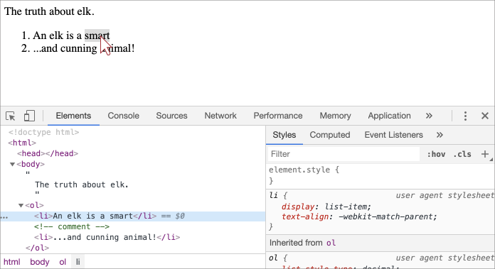

libs:
  - d3
  - domtree

---

# DOM Yapısı

<<<<<<< HEAD
Bir HTML belgesinin omurgası etiketlerdir.

Document Object Model (DOM)' a göre, her HTML etiketi bir nesnedir. İç içe geçmiş etiketlere, çevreleyen etiketin "alt öğeleri" denir.

Bir etiketin içindeki metin de bir nesnedir..

Tüm bu nesnelere JavaScript kullanılarak erişilebilir.

## Bir DOM örneği

Örneğin, bu belge için DOM'u inceleyelim:
=======
The backbone of an HTML document is tags.

According to the Document Object Model (DOM), every HTML tag is an object. Nested tags are  "children" of the enclosing one. The text inside a tag is an object as well.

All these objects are accessible using JavaScript, and we can use them to modify the page.

For example, `document.body` is the object representing the `<body>` tag.

Running this code will make the `<body>` red for 3 seconds:

```js run
document.body.style.background = 'red'; // make the background red

setTimeout(() => document.body.style.background = '', 3000); // return back
```

Here we used `style.background` to change the background color of `document.body`, but there are many other properties, such as:

- `innerHTML` -- HTML contents of the node.
- `offsetWidth` -- the node width (in pixels)
- ...and so on.

Soon we'll learn more ways to manipulate the DOM, but first we need to know about its structure.

## An example of the DOM

Let's start with the following simple document:
>>>>>>> 8d04d0d2db97276dbb2b451c30a7bd3e05d65831

```html run no-beautify
<!DOCTYPE HTML>
<html>
<head>
  <title>About elk</title>
</head>
<body>
  The truth about elk.
</body>
</html>
```

DOM, HTML'i etiketlerin ağaç yapısı olarak temsil eder. Şu şekilde görünür:

<div class="domtree"></div>

<script>
let node1 = {"name":"HTML","nodeType":1,"children":[{"name":"HEAD","nodeType":1,"children":[{"name":"#text","nodeType":3,"content":"\n  "},{"name":"TITLE","nodeType":1,"children":[{"name":"#text","nodeType":3,"content":"About elk"}]},{"name":"#text","nodeType":3,"content":"\n"}]},{"name":"#text","nodeType":3,"content":"\n"},{"name":"BODY","nodeType":1,"children":[{"name":"#text","nodeType":3,"content":"\n  The truth about elk.\n"}]}]}

drawHtmlTree(node1, 'div.domtree', 690, 320);
</script>

```online
Yukarıdaki resimde, eleman düğümlerine tıklayabilirsiniz ve çocukları açılacak / daralacaktır..
```

<<<<<<< HEAD
Etiketler *eleman düğümleri* veya sadece eleman olarak adlandırılır. İç içe geçmiş etiketler, çevreleyenlerin alt öğeleri olur. Sonuç olarak bir element ağacımız var: `<html>` burada köktür, sonra `<head>` ve `<body>` gelir bunlar ise html'nin çocuklarıdır vb.
=======
Every tree node is an object.

Tags are *element nodes* (or just elements) and form the tree structure: `<html>` is at the root, then `<head>` and `<body>` are its children, etc.
>>>>>>> 8d04d0d2db97276dbb2b451c30a7bd3e05d65831

Öğelerin içindeki metin,  `#text` olarak etiketlenmiş metin düğümleri oluşturur. Bir metin düğümü yalnızca bir dize içerir. Alt öğeleri olmayabilir ve her zaman ağacın bir yaprağıdır.

<<<<<<< HEAD
Örneğin, `<title>` etiketinde `"About elks"` metni bulunur.
=======
For instance, the `<title>` tag has the text `"About elk"`.
>>>>>>> 8d04d0d2db97276dbb2b451c30a7bd3e05d65831

Lütfen metin düğümlerindeki özel karakterlere dikkat edin:

- yeni satır: `↵` (Javascript'te bilineni: `\n`)
- boşluk: `␣`

<<<<<<< HEAD
Boşluklar ve satır sonları tamamen geçerli karakterlerdir, metin düğümleri oluştup DOM'un bir parçası olurlar. 
Dolayısıyla, örneğin yukarıdaki örnekte `<head>` etiketi, `<title>` dan önce bazı boşluklar içerir ve bu metin bir "#text" düğümü haline gelir (yalnızca bir satırsonu ve bazı boşluklar içerir).

Yalnızca iki üst düzey istisna vardır:
1. `<head>` öncesindeki boşluklar ve satırsonları tarihsel nedenlerden dolayı göz ardı edilir,
2. `</body>` 'den sonra bir şey koyarsak, HTML spesifikasyonu tüm içeriğin `<body>` içinde olmasını gerektirdiğinden, bu otomatik olarak sonunda "body" nin içine taşınır. Dolayısıyla `</body>` öğesinden sonra boşluk kalmayabilir..

Diğer durumlarda her şey basittir; eğer belgede boşluklar varsa (tıpkı herhangi bir karakter gibi), o zaman bunlar DOM'da metin düğümleri olurlar ve eğer onları kaldırırsak, o zaman kaybolacaklardır.
=======
Spaces and newlines are totally valid characters, like letters and digits. They form text nodes and become a part of the DOM. So, for instance, in the example above the `<head>` tag contains some spaces before `<title>`, and that text becomes a `#text` node (it contains a newline and some spaces only).

There are only two top-level exclusions:
1. Spaces and newlines before `<head>` are ignored for historical reasons.
2. If we put something after `</body>`, then that is automatically moved inside the `body`, at the end, as the HTML spec requires that all content must be inside `<body>`. So there can't be any spaces after `</body>`.

In other cases everything's straightforward -- if there are spaces (just like any character) in the document, then they become text nodes in the DOM, and if we remove them, then there won't be any.
>>>>>>> 8d04d0d2db97276dbb2b451c30a7bd3e05d65831

Yalnızca boşluk içeren metin düğümleri yoktur:

```html no-beautify
<!DOCTYPE HTML>
<html><head><title>About elk</title></head><body>The truth about elk.</body></html>
```

<div class="domtree"></div>

<script>
let node2 = {"name":"HTML","nodeType":1,"children":[{"name":"HEAD","nodeType":1,"children":[{"name":"TITLE","nodeType":1,"children":[{"name":"#text","nodeType":3,"content":"About elk"}]}]},{"name":"BODY","nodeType":1,"children":[{"name":"#text","nodeType":3,"content":"The truth about elk."}]}]}

drawHtmlTree(node2, 'div.domtree', 690, 210);
</script>

<<<<<<< HEAD
```smart header="Metinlerin baş/son bölümlerinde bulunan boşluk karakterleri ve sadece boşluk karakterinden oluşan metin düğümleri araçlarda genellikle gizlenir"
DOM ile çalışan tarayıcı araçları (yakında ele alınacaktır) genellikle metnin başında / sonunda boşluklar ve etiketler arasında boş metin düğümleri (satır sonları) göstermez.

Bunun nedeni, esas olarak HTML'yi dekore etmek için kullanılmaları ve gösterilme şeklini etkilememeleridir (çoğu durumda).

Daha fazla DOM resimlerinde, işleri kısa tutmak için bazen ilgisiz oldukları yerlerde bunları çıkarırız.
```


## Otomatik düzeltme

Tarayıcı hatalı biçimlendirilmiş HTML ile karşılaşırsa, DOM oluştururken bunu otomatik olarak düzeltir.

Örneğin, en üstteki etiket her zaman <html> olur. Belgede olmasa bile - DOM'da bulunacak, tarayıcı onu oluşturacaktır. Aynısı <body> için de geçerlidir .

Örnek olarak, HTML dosyası tek bir kelimeyse yani "Hello" gibi birşey ise , tarayıcı onu <html> içine saracak, gerekli olan <body> ve <head> kısmını ekleyecek ve DOM şu şekilde olacaktır:
=======
```smart header="Spaces at string start/end and space-only text nodes are usually hidden in tools"
Browser tools (to be covered soon) that work with DOM usually do not show spaces at the start/end of the text and empty text nodes (line-breaks) between tags.

Developer tools save screen space this way.

On further DOM pictures we'll sometimes omit them when they are irrelevant. Such spaces usually do not affect how the document is displayed.
```

## Autocorrection

If the browser encounters malformed HTML, it automatically corrects it when making the DOM.

For instance, the top tag is always `<html>`. Even if it doesn't exist in the document, it will exist in the DOM, because the browser will create it. The same goes for `<body>`.

As an example, if the HTML file is the single word `"Hello"`, the browser will wrap it into `<html>` and `<body>`, and add the required `<head>`, and the DOM will be:
>>>>>>> 8d04d0d2db97276dbb2b451c30a7bd3e05d65831


<div class="domtree"></div>

<script>
let node3 = {"name":"HTML","nodeType":1,"children":[{"name":"HEAD","nodeType":1,"children":[]},{"name":"BODY","nodeType":1,"children":[{"name":"#text","nodeType":3,"content":"Hello"}]}]}

drawHtmlTree(node3, 'div.domtree', 690, 150);
</script>

DOM oluşturulurken, tarayıcılar belgedeki hataları otomatik olarak işler, etiketleri kapatır vb.

<<<<<<< HEAD
Kapatılmamış etiketlere sahip böyle bir belge:
=======
A document with unclosed tags:
>>>>>>> 8d04d0d2db97276dbb2b451c30a7bd3e05d65831

```html no-beautify
<p>Hello
<li>Mom
<li>and
<li>Dad
```

<<<<<<< HEAD
...Tarayıcı etiketleri okurken ve eksik kısımları geri yüklerken normal bir DOM haline gelecektir:
=======
...will become a normal DOM as the browser reads tags and restores the missing parts:
>>>>>>> 8d04d0d2db97276dbb2b451c30a7bd3e05d65831

<div class="domtree"></div>

<script>
let node4 = {"name":"HTML","nodeType":1,"children":[{"name":"HEAD","nodeType":1,"children":[]},{"name":"BODY","nodeType":1,"children":[{"name":"P","nodeType":1,"children":[{"name":"#text","nodeType":3,"content":"Hello"}]},{"name":"LI","nodeType":1,"children":[{"name":"#text","nodeType":3,"content":"Mom"}]},{"name":"LI","nodeType":1,"children":[{"name":"#text","nodeType":3,"content":"and"}]},{"name":"LI","nodeType":1,"children":[{"name":"#text","nodeType":3,"content":"Dad"}]}]}]}

drawHtmlTree(node4, 'div.domtree', 690, 360);
</script>

<<<<<<< HEAD
````warn header="Tablolar her zaman `<tbody>` e sahiptir"
İlginç "özel durum" tablolardır. DOM şartnamesine göre <tbody> 'ye sahip olmaları gerekir, ancak HTML metni bunu (resmi olarak) ihmal edebilir. Ardından tarayıcı DOM içinde otomatik olarak <tbody> oluşturur. 
=======
````warn header="Tables always have `<tbody>`"
An interesting "special case" is tables. By DOM specification they must have `<tbody>` tag, but HTML text may omit it. Then the browser creates `<tbody>` in the DOM automatically.
>>>>>>> 8d04d0d2db97276dbb2b451c30a7bd3e05d65831

HTML gösterimi:

```html no-beautify
<table id="table"><tr><td>1</td></tr></table>
```

DOM yapısı olarak:
<div class="domtree"></div>

<script>
let node5 = {"name":"TABLE","nodeType":1,"children":[{"name":"TBODY","nodeType":1,"children":[{"name":"TR","nodeType":1,"children":[{"name":"TD","nodeType":1,"children":[{"name":"#text","nodeType":3,"content":"1"}]}]}]}]};

drawHtmlTree(node5,  'div.domtree', 600, 200);
</script>

<<<<<<< HEAD
Gördünüz mü ? Aniden `<tbody>` ortaya çıktı. Sürprizlerden kaçınmak için tablolarla çalışırken bunu aklınızda bulundurmalısınız.
=======
You see? The `<tbody>` appeared out of nowhere. We should keep this in mind while working with tables to avoid surprises.
>>>>>>> 8d04d0d2db97276dbb2b451c30a7bd3e05d65831
````

## Diğer düğüm türleri

Sayfaya daha fazla etiket ve bir yorum ekleyelim:


<<<<<<< HEAD
=======
There are some other node types besides elements and text nodes.

For example, comments:
>>>>>>> 8d04d0d2db97276dbb2b451c30a7bd3e05d65831

```html
<!DOCTYPE HTML>
<html>
<body>
  The truth about elk.
  <ol>
    <li>An elk is a smart</li>
*!*
    <!-- comment -->
*/!*
    <li>...and cunning animal!</li>
  </ol>
</body>
</html>
```

<div class="domtree"></div>

<script>
let node6 = {"name":"HTML","nodeType":1,"children":[{"name":"HEAD","nodeType":1,"children":[]},{"name":"BODY","nodeType":1,"children":[{"name":"#text","nodeType":3,"content":"\n  The truth about elk.\n  "},{"name":"OL","nodeType":1,"children":[{"name":"#text","nodeType":3,"content":"\n    "},{"name":"LI","nodeType":1,"children":[{"name":"#text","nodeType":3,"content":"An elk is a smart"}]},{"name":"#text","nodeType":3,"content":"\n    "},{"name":"#comment","nodeType":8,"content":"comment"},{"name":"#text","nodeType":3,"content":"\n    "},{"name":"LI","nodeType":1,"children":[{"name":"#text","nodeType":3,"content":"...and cunning animal!"}]},{"name":"#text","nodeType":3,"content":"\n  "}]},{"name":"#text","nodeType":3,"content":"\n\n\n"}]}]};

drawHtmlTree(node6, 'div.domtree', 690, 500);
</script>

<<<<<<< HEAD
Burada yeni bir ağaç düğümü türü görüyoruz `#comment` olarak etiketlenmiş bir yorum düğümü.
=======
We can see here a new tree node type -- *comment node*, labeled as `#comment`, between two text nodes.
>>>>>>> 8d04d0d2db97276dbb2b451c30a7bd3e05d65831

DOM'a neden bir yorum eklendiğini düşünebiliriz. Yorumlar sayfayı hiçbir şekilde etkilemez. Ancak bir kural vardır - HTML'de bir şey varsa, o zaman da DOM ağacında olmalıdır.

**HTML'deki her şey, hatta yorumlar bile DOM'un bir parçası haline gelir.**

<<<<<<< HEAD
HTML'nin en başındaki <! DOCTYPE ...> yönergesi bile bir DOM düğümüdür. DOM ağacında <html> 'den hemen öncedir. Bu düğüme dokunmayacağız, hatta bu nedenle onu diyagramlar üzerine çizmeyeceğiz, ama oradadır.
=======
Even the `<!DOCTYPE...>` directive at the very beginning of HTML is also a DOM node. It's in the DOM tree right before `<html>`. Few people know about that. We are not going to touch that node, we even don't draw it on diagrams, but it's there.
>>>>>>> 8d04d0d2db97276dbb2b451c30a7bd3e05d65831

Tüm belgeyi temsil eden `document` nesnesi, resmi olarak bir DOM düğümüdür

 [12 düğüm tipi](https://dom.spec.whatwg.org/#node) vardır. Pratikte genellikle 4 tanesiyle çalışırız:

<<<<<<< HEAD
1. `document` -- DOM'a "giriş noktasıdır".
2. eleman düğümleri - HTML etiketleri, ağaç yapı taşları.
3. metin düğümleri - metin içerir.
4. yorumlar - bazen bilgileri oraya koyabiliriz, kullanıcıya gösterilmez, ancak JS bunu DOM'dan okuyabilir.
=======
1. `document` -- the "entry point" into DOM.
2. element nodes -- HTML-tags, the tree building blocks.
3. text nodes -- contain text.
4. comments -- sometimes we can put information there, it won't be shown, but JS can read it from the DOM.
>>>>>>> 8d04d0d2db97276dbb2b451c30a7bd3e05d65831

## Kendin gör

<<<<<<< HEAD
DOM yapısını gerçek zamanlı görmek için, deneyin [Live DOM Viewer](http://software.hixie.ch/utilities/js/live-dom-viewer/). Sadece belgeyi yazın, DOM'u anında gösterecektir

## Tarayıcı geliştirici araçlarında görün
=======
To see the DOM structure in real-time, try [Live DOM Viewer](http://software.hixie.ch/utilities/js/live-dom-viewer/). Just type in the document, and it will show up as a DOM at an instant.
>>>>>>> 8d04d0d2db97276dbb2b451c30a7bd3e05d65831

DOM'u keşfetmenin bir başka yolu da tarayıcı geliştirici araçlarını kullanmaktır. Aslında, geliştirirken kullandığımız şey bu.

<<<<<<< HEAD
Bunu yapmak için web sayfasını açın [elks.html](elks.html), tarayıcı geliştirici araçlarını açın ve Öğeler sekmesine geçin.
=======
To do so, open the web page [elk.html](elk.html), turn on the browser developer tools and switch to the Elements tab.
>>>>>>> 8d04d0d2db97276dbb2b451c30a7bd3e05d65831

Böyle görünmeli:


DOM'u görebilir, öğelere tıklayabilir, ayrıntılarını görebilir ve daha fazlasını yapabilirsiniz.

Geliştirici araçlarındaki DOM yapısının basitleştirildiğini lütfen unutmayın. Metin düğümleri sadece metin olarak gösterilir. Ve "boş" (yalnızca boşluk) metin düğümleri de yoktur. Sorun değil, çünkü çoğu zaman eleman düğümleriyle ilgileniyoruz.

<<<<<<< HEAD
Sol üst köşedeki düğmeyi tıklamak <span class="devtools" style="background-position:-328px -124px"></span>, bir fare (veya diğer işaretçi aygıtları) kullanarak web sayfasından bir düğüm seçmeye ve onu "incelemeye" (Öğeler sekmesinde ona kaydırın) izin verir. Bu, büyük bir HTML sayfamız (ve buna karşılık gelen devasa DOM) olduğunda ve içindeki belirli bir öğenin yerini görmek istediğinde harika çalışıyor.

Bunu yapmanın başka bir yolu da bir web sayfasına sağ tıklayıp içerik menüsünde "İncele" yi seçmektir.
=======
Clicking the <span class="devtools" style="background-position:-328px -124px"></span> button in the left-upper corner allows us to choose a node from the webpage using a mouse (or other pointer devices) and "inspect" it (scroll to it in the Elements tab). This works great when we have a huge HTML page (and corresponding huge DOM) and would like to see the place of a particular element in it.
>>>>>>> 8d04d0d2db97276dbb2b451c30a7bd3e05d65831




Araçların sağ tarafında aşağıdaki alt sekmeler bulunur:

- **Stiller(Styles)** -- CSS'nin, yerleşik kurallar (gri) dahil olmak üzere belirli öğelere kurallar uygulandığını görebiliriz. Aşağıdaki kutunun boyutları / kenar boşlukları / dolgular dahil hemen hemen her şey yerinde düzenlenebilir.
- **Hesaplanmış (Computed)** -- öğeye uygulanan özellikleri CSS'de görmek için: her özellik için onu veren bir kural görebiliriz (CSS mirası vb. dahil).
- **Olay Dinleyicileri (Event Listeners)** -- DOM öğelerine eklenen olay dinleyicilerini görmek için (serinin sonraki bölümünde bunları ele alacağız). 
…ve bunun gibi.

Bunları incelemenin en iyi yolu, öğeye tıklamaktır. Değerlerin çoğu yerinde düzenlenebilir.

<<<<<<< HEAD
## Konsol ile etkileşim

DOM'u keşfederken, ona JavaScript de uygulamak isteyebiliriz. Örneğin: bir düğüm alın ve sonucu görmek için onu değiştirmek için bir kod çalıştırın. Öğeler sekmesi ve konsol arasında gezinmek için birkaç ipucu.
=======
As we work the DOM, we also may want to apply JavaScript to it. Like: get a node and run some code to modify it, to see the result. Here are few tips to travel between the Elements tab and the console.

For the start:

1. Select the first `<li>` in the Elements tab.
2. Press `key:Esc` -- it will open console right below the Elements tab.
>>>>>>> 8d04d0d2db97276dbb2b451c30a7bd3e05d65831

- Öğeler sekmesinde ilk `<li>` öğesini seçin.
- `key:Esc` tuşuna basın - konsolu Elements sekmesinin hemen altında açacaktır.

Artık son seçilen öğe `$0` olarak mevcut, önceden seçilen öğe `$1` vb.

<<<<<<< HEAD
Onlara komutlar çalıştırabiliriz. Örneğin, `$0.style.background = 'red'` seçilen liste öğesini şu şekilde kırmızı yapar:


Diğer taraftan, eğer konsoldaysak ve bir DOM düğümünü referans alan bir değişkenimiz varsa, o zaman komutu `inspect(node)` Elementler bölmesinde görmek için kullanabiliriz.
Ya da bunu konsola çıkarabilir ve `document.body` kısmını aşağıdaki gibi "yerinde" keşfedebiliriz:

=======


That's how to get a node from Elements in Console.

There's also a road back. If there's a variable referencing a DOM node, then we can use the command `inspect(node)` in Console to see it in the Elements pane.

Or we can just output the DOM node in the console and explore "in-place", like `document.body` below:


>>>>>>> 8d04d0d2db97276dbb2b451c30a7bd3e05d65831

Bu elbette hata ayıklama amaçlıdır. Bir sonraki bölümde DOM'a JavaScript kullanarak erişip değiştireceğiz.

Tarayıcı geliştirici araçları, geliştirmede harika bir yardımcıdır: DOM'u keşfedebilir, bir şeyler deneyebilir ve neyin yanlış gittiğini görebiliriz.

## Özet

Bir HTML / XML belgesi tarayıcının içinde DOM ağacı olarak temsil edilir.

- Etiketler eleman düğümleri haline gelir ve yapıyı oluşturur.
- Metin, metin düğümleri haline gelir.
- HTML'deki her şeyin yeri, hatta yorumlar da DOM'da vardır.

DOM'u incelemek ve manuel olarak değiştirmek için geliştirici araçlarını kullanabiliriz.
Burada, başlangıç için en çok kullanılan ve önemli eylemlerin temellerini ele aldık. Chrome Geliştirici Araçları hakkında kapsamlı bir dokümantasyon vardır <https://developers.google.com/web/tools/chrome-devtools>. Bu araçları öğrenmenin en iyi yolu, onlara tıklamak, menüleri okumaktır. Çoğu seçenek tıklamaya açıktır. Daha sonra, onları genel olarak tanıdığınızda, belgeleri okuyun ve gerisini alın.

<<<<<<< HEAD
DOM düğümleri, aralarında gezinmeye, değiştirmeye, sayfada dolaşmaya ve daha pek çok şeye izin veren özelliklere ve yöntemlere sahiptir. Sonraki bölümlerde onlara değineceğiz.
=======
DOM nodes have properties and methods that allow us to travel between them, modify them, move around the page, and more. We'll get down to them in the next chapters.
>>>>>>> 8d04d0d2db97276dbb2b451c30a7bd3e05d65831
