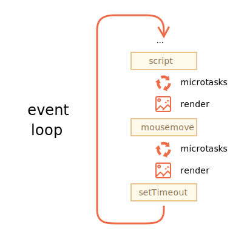

<<<<<<< HEAD
# Olay döngüsü: microtasks ve macrotasks

Node.js'de olduğu gibi tarayıcı JavaScript yürütme akışı da bir *olay döngüsüne* dayanır.

Olay döngüsünün nasıl çalıştığını anlamak, optimizasyonlar ve bazen de doğru mimari için önemlidir.

Bu bölümde önce işlerin nasıl yürüdüğüyle ilgili teorik ayrıntıları ele alacağız ve ardından bu bilginin pratik uygulamalarını göreceğiz.

## Olay Döngüsü

*Olay döngüsü* kavramı çok basittir. JavaScript motorunun görevleri beklediği, yürüttüğü ve daha sonra uyuyarak daha fazla görev beklediği sonsuz bir döngü vardır.

Motorun genel algoritması:

1. Görevler varken:
    - en eski görevden başlayarak bunları yürütün.
2. Bir görev görünene kadar uyuyun, ardından 1'e gidin.

Bu, bir sayfaya göz atarken gördüğümüz şeyin biçimselleştirilmesidir. JavaScript motoru çoğu zaman hiçbir şey yapmaz, yalnızca bir script/işleyici/olay etkinleştirildiğinde çalışır.

Görev örnekleri:

- Harici bir script `<script src="...">` yüklendiğinde, görev onu yürütmektir.
- Bir kullanıcı faresini hareket ettirdiğinde, görev `mousemove` olayını göndermek ve işleyicileri yürütmektir.
- Zamanlanmış bir `setTimeout` için zaman geldiğinde, görev callback'i çalıştırmaktır.
- ...ve benzeri.

Görevler belirlenir - motor bunları işler - sonra daha fazla görev bekler (uyurken ve sıfıra yakın CPU tüketirken).

Motor meşgulken bir görev gelebilir, sonra sıraya girebilir.

Görevler, "macrotask sırası" (v8 terimi) olarak adlandırılan bir sıra oluşturur:


Örneğin, motor bir `script`'i yürütmekle meşgulken, bir kullanıcı faresini hareket ettirerek `mousemove`'a neden olabilir ve `setTimeout` zamanı gelmiş olabilir ve benzeri, yukarıdaki resimde gösterildiği gibi bu görevler bir kuyruk oluşturur.

Kuyruktaki görevler "ilk gelene ilk hizmet" esasına göre işlenir. Tarayıcı motoru `script` ile işi bittiğinde, `mousemove` olayını, ardından `setTimeout` işleyicisini vb. işler.

Buraya kadar oldukça basit, değil mi?

İki ayrıntı daha:
1. Motor bir görevi yürütürken oluşturma(Render) asla gerçekleşmez. Görevin uzun sürmesi önemli değil. DOM'daki değişiklikler yalnızca görev tamamlandıktan sonra boyanır.
2. Bir görev çok uzun sürerse tarayıcı, kullanıcı olaylarını işleme gibi diğer görevleri yapamaz. Bu yüzden bir süre sonra "Sayfa Yanıt Vermiyor" gibi bir uyarı vererek görevi tüm sayfayla sonlandırmayı önerir. Bu, çok sayıda karmaşık hesaplama olduğunda veya sonsuz bir döngüye yol açan bir programlama hatası olduğunda olur.

Teori buydu. Şimdi bu bilgiyi nasıl uygulayabileceğimizi görelim.

## Kullanım Senaryosu 1: CPU'ya aç görevleri bölme

Diyelim ki CPU'ya aç bir görevimiz var.

Örneğin, sözdizimi vurgulama(syntax-highlighting) (bu sayfadaki kod örneklerini renklendirmek için kullanılır) oldukça CPU ağırlıklıdır. Kodu vurgulamak için, analizi gerçekleştirir, birçok renkli öğe oluşturur, bunları belgeye ekler - çok fazla zaman alan büyük miktarda metin için.

Motor sözdizimi vurgulama ile meşgulken, DOM ile ilgili diğer işlemleri yapamaz, kullanıcı olaylarını işleyemez vb. Hatta tarayıcının bir süre "hıçkırmasına" ve hatta "takılmasına" neden olabilir ki bu kabul edilemez bir durumdur.

Büyük görevi parçalara bölerek sorunlardan kaçınabiliriz. İlk 100 satırı vurgulayın, ardından sonraki 100 satır için "setTimeout" (sıfır gecikmeli) zamanlayın, vb.

Bu yaklaşımı göstermek için, basitlik adına, metin vurgulama yerine `1` ile `1000000000` arasında sayan bir fonksiyon alalım.

Aşağıdaki kodu çalıştırırsanız, motor bir süre "askıda kalır". Açıkça fark edilen sunucu tarafı JS için ve tarayıcıda çalıştırıyorsanız, sayfadaki diğer düğmeleri tıklamayı deneyin - sayım bitene kadar başka hiçbir olayın işlenmediğini göreceksiniz.
=======
# Event loop: microtasks and macrotasks

Browser JavaScript execution flow, as well as in Node.js, is based on an *event loop*.

Understanding how event loop works is important for optimizations, and sometimes for the right architecture.

In this chapter we first cover theoretical details about how things work, and then see practical applications of that knowledge.

## Event Loop

The *event loop* concept is very simple. There's an endless loop, where the JavaScript engine waits for tasks, executes them and then sleeps, waiting for more tasks.

The general algorithm of the engine:

1. While there are tasks:
    - execute them, starting with the oldest task.
2. Sleep until a task appears, then go to 1.

That's a formalization for what we see when browsing a page. The JavaScript engine does nothing most of the time, it only runs if a script/handler/event activates.

Examples of tasks:

- When an external script `<script src="...">` loads, the task is to execute it.
- When a user moves their mouse, the task is to dispatch `mousemove` event and execute handlers.
- When the time is due for a scheduled `setTimeout`, the task is to run its callback.
- ...and so on.

Tasks are set -- the engine handles them -- then waits for more tasks (while sleeping and consuming close to zero CPU).

It may happen that a task comes while the engine is busy, then it's enqueued.

The tasks form a queue, so-called "macrotask queue" (v8 term):


For instance, while the engine is busy executing a `script`, a user may move their mouse causing `mousemove`, and `setTimeout` may be due and so on, these tasks form a queue, as illustrated on the picture above.

Tasks from the queue are processed on "first come – first served" basis. When the engine browser is done with the `script`, it handles `mousemove` event, then `setTimeout` handler, and so on.

So far, quite simple, right?

Two more details:
1. Rendering never happens while the engine executes a task. It doesn't matter if the task takes a long time. Changes to the DOM are painted only after the task is complete.
2. If a task takes too long, the browser can't do other tasks, such as processing user events. So after a time, it raises an alert like "Page Unresponsive", suggesting killing the task with the whole page. That happens when there are a lot of complex calculations or a programming error leading to an infinite loop.

That was the theory. Now let's see how we can apply that knowledge.

## Use-case 1: splitting CPU-hungry tasks

Let's say we have a CPU-hungry task.

For example, syntax-highlighting (used to colorize code examples on this page) is quite CPU-heavy. To highlight the code, it performs the analysis, creates many colored elements, adds them to the document -- for a large amount of text that takes a lot of time.

While the engine is busy with syntax highlighting, it can't do other DOM-related stuff, process user events, etc. It may even cause the browser to "hiccup" or even "hang" for a bit, which is unacceptable.

We can avoid problems by splitting the big task into pieces. Highlight first 100 lines, then schedule `setTimeout` (with zero-delay) for the next 100 lines, and so on.

To demonstrate this approach, for the sake of simplicity, instead of text-highlighting, let's take a function that counts from `1` to `1000000000`.

If you run the code below, the engine will "hang" for some time. For server-side JS that's clearly noticeable, and if you are running it in-browser, then try to click other buttons on the page -- you'll see that no other events get handled until the counting finishes.
>>>>>>> 193319c963b9ba86ac7d9590f7261a36ecdcc4d2

```js run
let i = 0;

let start = Date.now();

function count() {

<<<<<<< HEAD
  // ağır bir iş yap
=======
  // do a heavy job
>>>>>>> 193319c963b9ba86ac7d9590f7261a36ecdcc4d2
  for (let j = 0; j < 1e9; j++) {
    i++;
  }

  alert("Done in " + (Date.now() - start) + 'ms');
}

count();
```

<<<<<<< HEAD
Tarayıcı, "script çok uzun sürüyor" uyarısı bile gösterebilir.

İşi iç içe `setTimeout` çağrılarını kullanarak bölelim:
=======
The browser may even show a "the script takes too long" warning.

Let's split the job using nested `setTimeout` calls:
>>>>>>> 193319c963b9ba86ac7d9590f7261a36ecdcc4d2

```js run
let i = 0;

let start = Date.now();

function count() {

<<<<<<< HEAD
  // ağır işin bir parçasını yap (*)
=======
  // do a piece of the heavy job (*)
>>>>>>> 193319c963b9ba86ac7d9590f7261a36ecdcc4d2
  do {
    i++;
  } while (i % 1e6 != 0);

  if (i == 1e9) {
    alert("Done in " + (Date.now() - start) + 'ms');
  } else {
<<<<<<< HEAD
    setTimeout(count); // yeni cağrıyı planla (**)
=======
    setTimeout(count); // schedule the new call (**)
>>>>>>> 193319c963b9ba86ac7d9590f7261a36ecdcc4d2
  }

}

count();
```

<<<<<<< HEAD
Artık tarayıcı arayüzü "sayma" işlemi sırasında tamamen işlevseldir.

A single run of `count` does a part of the job `(*)`, and then re-schedules itself `(**)` if needed:
Tek bir `count` çalıştırması `(*)` işinin bir bölümünü yapar ve ardından gerekirse kendisini `(**)` olarak yeniden zamanlar:

1. İlk çalıştırma sayar: `i=1...1000000`.
2. İkinci çalıştırma sayar: `i=1000001..2000000`.
3. ...ve benzeri.

Şimdi, motor bölüm 1'i yürütmekle meşgulken yeni bir yan görev (örneğin `onclick` olayı) ortaya çıkarsa, sıraya alınır ve sonraki bölümden önce bölüm 1 bittiğinde yürütülür. `count` yürütmeleri arasındaki olay döngüsüne periyodik geri dönüşler, JavaScript motorunun başka bir şey yapması, diğer kullanıcı eylemlerine tepki vermesi için yeterli "hava" sağlar.

Dikkate değer olan şey, her iki varyantın da -- işi `setTimeout` ile bölerek ve bölmeden -- hız açısından karşılaştırılabilir olmasıdır. Toplam sayım süresinde pek bir fark yok.

Onları daha da yakınlaştırmak için bir iyileştirme yapalım.

Zamanlamayı `count()`un başına taşıyacağız:
=======
Now the browser interface is fully functional during the "counting" process.

A single run of `count` does a part of the job `(*)`, and then re-schedules itself `(**)` if needed:

1. First run counts: `i=1...1000000`.
2. Second run counts: `i=1000001..2000000`.
3. ...and so on.

Now, if a new side task (e.g. `onclick` event) appears while the engine is busy executing part 1, it gets queued and then executes when part 1 finished, before the next part. Periodic returns to the event loop between `count` executions provide just enough "air" for the JavaScript engine to do something else, to react to other user actions.

The notable thing is that both variants -- with and without splitting the job by `setTimeout` -- are comparable in speed. There's not much difference in the overall counting time.

To make them closer, let's make an improvement.

We'll move the scheduling to the beginning of the `count()`:
>>>>>>> 193319c963b9ba86ac7d9590f7261a36ecdcc4d2

```js run
let i = 0;

let start = Date.now();

function count() {

<<<<<<< HEAD
  // zamanlamayı en başa taşı
  if (i < 1e9 - 1e6) {
    setTimeout(count); // yeni cağrıyı planla 
=======
  // move the scheduling to the beginning
  if (i < 1e9 - 1e6) {
    setTimeout(count); // schedule the new call
>>>>>>> 193319c963b9ba86ac7d9590f7261a36ecdcc4d2
  }

  do {
    i++;
  } while (i % 1e6 != 0);

  if (i == 1e9) {
    alert("Done in " + (Date.now() - start) + 'ms');
  }

}

count();
```

<<<<<<< HEAD
Şimdi `count()` yapmaya başladığımızda ve daha fazla `count()` yapmamız gerektiğini gördüğümüzde, işi yapmadan önce bunu hemen zamanlıyoruz.

Çalıştırırsanız, önemli ölçüde daha az zaman aldığını fark etmek kolaydır.

Neden?  

Çok basit: Hatırladığınız gibi, iç içe geçmiş birçok `setTimeout` çağrısı için tarayıcıda minimum 4 ms gecikme vardır. `0` ayarlasak bile, `4ms` (veya biraz daha fazla). Yani ne kadar erken zamanlarsak o kadar hızlı çalışır.

Son olarak, CPU'ya aç bir görevi parçalara ayırdık - artık kullanıcı arayüzünü engellemiyor. Ve genel yürütme süresi çok daha uzun değil.

## Kullanım Senaryosu 2: ilerleme göstergesi

Tarayıcı komut dosyaları için ağır görevleri bölmenin bir başka yararı da ilerleme göstergesi gösterebilmemizdir.

Daha önce belirtildiği gibi, DOM'daki değişiklikler, ne kadar sürdüğüne bakılmaksızın, yalnızca şu anda çalışan görev tamamlandıktan sonra boyanır.

Bir yandan, bu harika, çünkü fonksiyonumuz birçok öğe oluşturabilir, bunları tek tek belgeye ekleyebilir ve stillerini değiştirebilir -- ziyaretçi herhangi bir "ara", tamamlanmamış durum görmez. Önemli bir şey, değil mi?

İşte demo, `i`'deki değişiklikler fonksiyon bitene kadar görünmeyecek, bu yüzden yalnızca son değeri göreceğiz:
=======
Now when we start to `count()` and see that we'll need to `count()` more, we schedule that immediately, before doing the job.

If you run it, it's easy to notice that it takes significantly less time.

Why?  

That's simple: as you remember, there's the in-browser minimal delay of 4ms for many nested `setTimeout` calls. Even if we set `0`, it's `4ms` (or a bit more). So the earlier we schedule it - the faster it runs.

Finally, we've split a CPU-hungry task into parts - now it doesn't block the user interface. And its overall execution time isn't much longer.

## Use case 2: progress indication

Another benefit of splitting heavy tasks for browser scripts is that we can show progress indication.

As mentioned earlier, changes to DOM are painted only after the currently running task is completed, irrespective of how long it takes.

On one hand, that's great, because our function may create many elements, add them one-by-one to the document and change their styles -- the visitor won't see any "intermediate", unfinished state. An important thing, right?

Here's the demo, the changes to `i` won't show up until the function finishes, so we'll see only the last value:
>>>>>>> 193319c963b9ba86ac7d9590f7261a36ecdcc4d2


```html run
<div id="progress"></div>

<script>

  function count() {
    for (let i = 0; i < 1e6; i++) {
      i++;
      progress.innerHTML = i;
    }
  }

  count();
</script>
```

<<<<<<< HEAD
...Ancak görev sırasında da bir şey göstermek isteyebiliriz, örneğin bir ilerleme çubuğu.

Eğer ağır görevi `setTimeout` kullanarak parçalara ayırırsak, o zaman değişiklikler aralarında boyanır.

Bu daha güzel görünüyor:
=======
...But we also may want to show something during the task, e.g. a progress bar.

If we split the heavy task into pieces using `setTimeout`, then changes are painted out in-between them.

This looks prettier:
>>>>>>> 193319c963b9ba86ac7d9590f7261a36ecdcc4d2

```html run
<div id="progress"></div>

<script>
  let i = 0;

  function count() {

<<<<<<< HEAD
    // ağır işin bir parçasını yap (*)
=======
    // do a piece of the heavy job (*)
>>>>>>> 193319c963b9ba86ac7d9590f7261a36ecdcc4d2
    do {
      i++;
      progress.innerHTML = i;
    } while (i % 1e3 != 0);

    if (i < 1e7) {
      setTimeout(count);
    }

  }

  count();
</script>
```

<<<<<<< HEAD
Şimdi `<div>`, bir tür ilerleme çubuğu olan `i`'nin artan değerlerini gösteriyor.


## Kullanım Senaryosu 3: olaydan sonra bir şeyler yapmak

Bir olay işleyicide, bazı eylemleri olay kabarıp tüm seviyelerde işlenene kadar ertelemeye karar verebiliriz. Bunu, kodu sıfır gecikmeli `setTimeout` içine sararak yapabiliriz.

<bilgi:olayları gönderme(dispatch-events)> bölümünde bir örnek gördük: `menu-open` özel olayı(custom event) `setTimeout` içinde gönderilir, böylece "click" olayı tamamen işlendikten sonra gerçekleşir.
=======
Now the `<div>` shows increasing values of `i`, a kind of a progress bar.


## Use case 3: doing something after the event

In an event handler we may decide to postpone some actions until the event bubbled up and was handled on all levels. We can do that by wrapping the code in zero delay `setTimeout`.

In the chapter <info:dispatch-events> we saw an example: custom event `menu-open` is dispatched in `setTimeout`, so that it happens after the "click" event is fully handled.
>>>>>>> 193319c963b9ba86ac7d9590f7261a36ecdcc4d2

```js
menu.onclick = function() {
  // ...

<<<<<<< HEAD
  // tıklanan menü öğesi verileriyle özel bir olay oluşturun
=======
  // create a custom event with the clicked menu item data
>>>>>>> 193319c963b9ba86ac7d9590f7261a36ecdcc4d2
  let customEvent = new CustomEvent("menu-open", {
    bubbles: true
  });

<<<<<<< HEAD
  // özel olayı eşzamansız(asynchronously) olarak gönder
=======
  // dispatch the custom event asynchronously
>>>>>>> 193319c963b9ba86ac7d9590f7261a36ecdcc4d2
  setTimeout(() => menu.dispatchEvent(customEvent));
};
```

<<<<<<< HEAD
## Macrotasks ve Microtasks

Bu bölümde açıklanan *macrotask*'ler ile birlikte, <bilgi:microtasks-sırası> bölümünde bahsedilen *microtask*'ler vardır.

Microtask'ler yalnızca kodumuzdan gelir. Genellikle promise'larla oluşturulurlar: `.then/catch/finally` işleyicisinin yürütülmesi bir microtask haline gelir. Microtask'ler, bir başka promise işleme biçimi olduğu için, `wait`'in "örtüsü altında" da kullanılır.

Ayrıca, microtask kuyruğunda yürütülmek üzere `func`'u sıraya sokan özel bir `queueMicrotask(func)` fonksiyonu da vardır.

**Her macrotask'dan hemen sonra, motor, diğer macrotask'ları çalıştırmadan veya oluşturmadan veya başka herhangi bir şeyden önce tüm görevleri microtask kuyruğundan yürütür.**

Örneğin, bir göz atın:
=======
## Macrotasks and Microtasks

Along with *macrotasks*, described in this chapter, there are *microtasks*, mentioned in the chapter <info:microtask-queue>.

Microtasks come solely from our code. They are usually created by promises: an execution of `.then/catch/finally` handler becomes a microtask. Microtasks are used "under the cover" of `await` as well, as it's another form of promise handling.

There's also a special function `queueMicrotask(func)` that queues `func` for execution in the microtask queue.

**Immediately after every *macrotask*, the engine executes all tasks from *microtask* queue, prior to running any other macrotasks or rendering or anything else.**

For instance, take a look:
>>>>>>> 193319c963b9ba86ac7d9590f7261a36ecdcc4d2

```js run
setTimeout(() => alert("timeout"));

Promise.resolve()
  .then(() => alert("promise"));

alert("code");
```

<<<<<<< HEAD
Buradaki sıra ne olacak?

1. Sıradan bir eşzamanlı(synchronous) çağrı olduğu için önce `kod` gösterilir.
2. `promise` ikinci sıradadır, çünkü `.then` microtask kuyruğundan geçer ve geçerli koddan sonra çalışır.
3. `timeout`'u en son gösterir, çünkü bu bir macrotask'dir.

Daha zengin olay döngüsü resmi şöyle görünür (sıra yukarıdan aşağıya doğrudur, yani: önce script, ardından microtask'ler, oluşturma(rendering) vb.):



Tüm microtask'ler, başka herhangi bir olay işleme(handling) veya oluşturma(rendering) veya başka herhangi bir macrotask gerçekleşmeden önce tamamlanır.

Uygulama ortamının microtask'ler arasında temelde aynı olmasını (fare koordinat değişikliği yok, yeni ağ verisi yok, vb.) garanti ettiği için bu önemlidir.

Bir fonksiyonu eşzamansız(asynchronously) olarak (geçerli koddan sonra) yürütmek istiyorsak, ancak değişiklikler oluşturulmadan(rendered) veya yeni olaylar işlenmeden(handled) önce, bunu `queueMicrotask` ile zamanlayabiliriz.

Here's an example with "counting progress bar", similar to the one shown previously, but `queueMicrotask` is used instead of `setTimeout`. You can see that it renders at the very end. Just like the synchronous code:
Burada, daha önce gösterilene benzer bir "sayan ilerleme çubuğu" örneği verilmiştir, ancak `setTimeout` yerine `queueMicrotask` kullanılmıştır. En sonunda oluştuğunu(render) görebilirsiniz. Tıpkı senkron kod gibi:
=======
What's going to be the order here?

1. `code` shows first, because it's a regular synchronous call.
2. `promise` shows second, because `.then` passes through the microtask queue, and runs after the current code.
3. `timeout` shows last, because it's a macrotask.

The richer event loop picture looks like this (order is from top to bottom, that is: the script first, then microtasks, rendering and so on):


All microtasks are completed before any other event handling or rendering or any other macrotask takes place.

That's important, as it guarantees that the application environment is basically the same (no mouse coordinate changes, no new network data, etc) between microtasks.

If we'd like to execute a function asynchronously (after the current code), but before changes are rendered or new events handled, we can schedule it with `queueMicrotask`.

Here's an example with "counting progress bar", similar to the one shown previously, but `queueMicrotask` is used instead of `setTimeout`. You can see that it renders at the very end. Just like the synchronous code:
>>>>>>> 193319c963b9ba86ac7d9590f7261a36ecdcc4d2

```html run
<div id="progress"></div>

<script>
  let i = 0;

  function count() {

<<<<<<< HEAD
    // ağır işin bir parçasını yap (*)
=======
    // do a piece of the heavy job (*)
>>>>>>> 193319c963b9ba86ac7d9590f7261a36ecdcc4d2
    do {
      i++;
      progress.innerHTML = i;
    } while (i % 1e3 != 0);

    if (i < 1e6) {
  *!*
      queueMicrotask(count);
  */!*
    }

  }

  count();
</script>
```

<<<<<<< HEAD
## Özet

Daha ayrıntılı bir olay döngüsü algoritması (yine de [spesifikasyona](https://html.spec.whatwg.org/multipage/webappapis.html#event-loop-processing-model) kıyasla basitleştirilmiş olsa da):

1. En eski görevi *macrotask* kuyruğundan ayırın ve çalıştırın (ör. "script").
2. Tüm *microtask*'leri yürütün:
    - Microtask kuyruğu boş değilken:
        - En eski microtask'i sıraya alın ve çalıştırın.
3. Varsa oluşturme(render) değişiklikleri.
4. Macrotask kuyruğu boşsa, bir macrotask görünene kadar bekleyin.
5. 1.Adıma gidin.

Yeni bir *macrotask* zamanlamak için:
- Sıfır gecikmeli `setTimeout(f)` kullanın.

Bu, tarayıcının kullanıcı olaylarına tepki verebilmesi ve aralarındaki ilerlemeyi gösterebilmesi için büyük bir hesaplama ağırlıklı görevi parçalara ayırmak için kullanılabilir.

Ayrıca, olay tamamen işlendikten (köpürme işlemi) sonra bir eylem zamanlamak için olay işleyicilerinde kullanılır.

Yeni bir *microtask* planlamak için
- `queueMicrotask(f)` kullanın.
- Ayrıca promise işleyicileri microtask kuyruğundan geçer.

Microtask'ler arasında UI veya ağ olayı işleme yoktur: Bunlar birbiri ardına hemen çalışır.

Bu nedenle, bir fonksiyonu eşzamansız(asynchronously) olarak ancak ortam durumu içinde yürütmek için `queueMicrotask` isteyebilirsiniz.

```smart header="Web Workers"
Olay döngüsünü engellememesi gereken uzun ağır hesaplamalar için [Web Workers](https://html.spec.whatwg.org/multipage/workers.html)'ı kullanabiliriz.

Bu, başka bir paralel iş parçacığında(thread) kod çalıştırmanın bir yoludur.

Web Workers ana süreçle mesaj alışverişinde bulunabilirler, ancak kendi değişkenleri ve kendi olay döngüleri vardır.

Web Worker'larının DOM'a erişimi yoktur, bu nedenle, esas olarak hesaplamalar için, aynı anda birden fazla CPU çekirdeği kullanmak için yararlıdırlar.
=======
## Summary

A more detailed event loop algorithm (though still simplified compared to the [specification](https://html.spec.whatwg.org/multipage/webappapis.html#event-loop-processing-model)):

1. Dequeue and run the oldest task from the *macrotask* queue (e.g. "script").
2. Execute all *microtasks*:
    - While the microtask queue is not empty:
        - Dequeue and run the oldest microtask.
3. Render changes if any.
4. If the macrotask queue is empty, wait till a macrotask appears.
5. Go to step 1.

To schedule a new *macrotask*:
- Use zero delayed `setTimeout(f)`.

That may be used to split a big calculation-heavy task into pieces, for the browser to be able to react to user events and show progress between them.

Also, used in event handlers to schedule an action after the event is fully handled (bubbling done).

To schedule a new *microtask*
- Use `queueMicrotask(f)`.
- Also promise handlers go through the microtask queue.

There's no UI or network event handling between microtasks: they run immediately one after another.

So one may want to `queueMicrotask` to execute a function asynchronously, but within the environment state.

```smart header="Web Workers"
For long heavy calculations that shouldn't block the event loop, we can use [Web Workers](https://html.spec.whatwg.org/multipage/workers.html).

That's a way to run code in another, parallel thread.

Web Workers can exchange messages with the main process, but they have their own variables, and their own event loop.

Web Workers do not have access to DOM, so they are useful, mainly, for calculations, to use multiple CPU cores simultaneously.
>>>>>>> 193319c963b9ba86ac7d9590f7261a36ecdcc4d2
```
